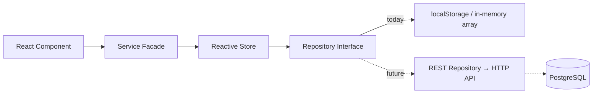

# iFluids PMO Portal
## Frontend Data Mapping & Architecture Blueprint
### Version 1.0

**Prepared for:** iFluids Engineering — PMO Portal Backend Development Program
**Scope:** Complete as-built documentation of the existing React/TypeScript frontend, as a master reference for building the Node.js/Express/PostgreSQL backend.
**Method:** This document describes the frontend **exactly as it exists today**. Nothing here is a proposal, a redesign, or a new feature — it is a factual record of implemented behavior, current mock data sources, and known gaps.

---

## Table of Contents

1. [Executive Summary](#1-executive-summary)
2. [Global Architecture](#2-global-architecture)
   - 2.1 [Application Entry & Routing](#21-application-entry--routing)
   - 2.2 [Authentication](#22-authentication)
   - 2.3 [Real-Time Data Refresh Pattern](#23-real-time-data-refresh-pattern)
   - 2.4 [Repository → Store → Service Architecture Pattern](#24-repository--store--service-architecture-pattern)
   - 2.5 [LocalStorage Inventory](#25-localstorage-inventory)
   - 2.6 [Service Layer Inventory](#26-service-layer-inventory)
   - 2.7 [TypeScript Model Inventory](#27-typescript-model-inventory)
   - 2.8 [Custom Hooks Inventory](#28-custom-hooks-inventory)
   - 2.9 [Utilities Inventory](#29-utilities-inventory)
3. [Component Hierarchy](#3-component-hierarchy)
4. [Module Documentation](#4-module-documentation)
   - 4.1 [Dashboard](#41-dashboard)
   - 4.2 [Projects — Repository / Add / Edit / View](#42-projects--repository--add--edit--view)
   - 4.3 [Team Assigned](#43-team-assigned)
   - 4.4 [Quantity](#44-quantity)
   - 4.5 [Payment Milestones](#45-payment-milestones)
   - 4.6 [Expense Budget & Other Project Expenses](#46-expense-budget--other-project-expenses)
   - 4.7 [Invoice Workspace](#47-invoice-workspace)
   - 4.8 [Customer Master](#48-customer-master)
   - 4.9 [Manpower](#49-manpower)
   - 4.10 [Timesheets & Project Timesheet Pending Repository](#410-timesheets--project-timesheet-pending-repository)
   - 4.11 [Reports](#411-reports)
   - 4.12 [Settings → User Management](#412-settings--user-management)
   - 4.13 [Security & Audit Logs](#413-security--audit-logs)
   - 4.14 [Notifications](#414-notifications)
   - 4.15 [Reminders](#415-reminders)
5. [Known Architectural Gaps, Legacy Code & Dead Code](#5-known-architectural-gaps-legacy-code--dead-code)
6. [Appendix — Full TypeScript Model Definitions](#6-appendix--full-typescript-model-definitions)

---

## 1. Executive Summary

The iFluids PMO Portal frontend is a **React 19 + TypeScript + Vite 8 + Tailwind CSS 4** single-page application. It is currently **100% frontend-only**: there is no backend server, no REST API, and no SQL database anywhere in the stack. Every module persists its data either to **browser `localStorage`** (Projects, Customers, Employees/Manpower, Timesheets, Notifications, Reminders, Auth session, Theme, User Profile) or to **plain in-memory JavaScript arrays that reset on page reload** (User Management, Department/Reporting-Manager directories, Toasts).

Two architectural conventions run through almost every module and should be preserved conceptually in the backend design:

1. **A single app-wide "data changed" event.** Any service that mutates data calls `window.dispatchEvent(new Event("pmo:data-changed"))`. Every page/widget that needs to stay live either uses the `useLiveRefresh()` hook or a raw event listener to re-fetch its own data when this fires. There is no central store/reducer — each module re-reads its own source of truth on every tick. A few sub-systems use narrower sibling events (`pmo:notifications-changed`, `pmo:reminders-changed`, `pmo:toast-changed`) to avoid over-triggering unrelated re-renders.
2. **A Repository → Store → Service (facade) layering.** Introduced first for Notifications and Reminders, and reused verbatim for the newer User Management module. A `Repository` is a thin `{getAll, saveAll}` interface backed by either `localStorage` or an in-memory array. A `Store` holds the live working copy, exposes mutation methods, and always does *persist → emit event* as its last step. A `Service` (facade) is the only thing the rest of the app imports, and is written to already look like a REST client (`getX`, `createX`, `updateX`, `deleteX`) even though it currently talks to a local repository. **This is the intended seam for backend integration** — swapping a `ClientXRepository`/`InMemoryXRepository` for a `RestXRepository` should require zero changes to any UI component.

This document catalogs every module, service, model, and localStorage key needed to design the real PostgreSQL schema (Document 2) and REST API (Document 3). Section 5 separately calls out **dead/legacy code and known data-integrity gaps** the backend team should be aware of so they are not accidentally re-implemented as if they were the intended design.

---

## 2. Global Architecture

### 2.1 Application Entry & Routing

`src/App.tsx` wraps the app in `AuthProvider` (`src/auth/authContext.tsx`) and a `BrowserRouter`. Only two top-level routes exist:

| Path | Renders | Guard |
|---|---|---|
| `/login` | `Login` (`src/pages/Login/Login.tsx`) | none |
| `/*` | `MainLayout` (`src/layouts/MainLayout.tsx`) | `ProtectedRoute` — redirects to `/login` if no authenticated session |

`ProtectedRoute` is the **only** route guard in the entire application — it is all-or-nothing (no per-route or per-role guarding exists client-side today; `User.moduleAccess`/`projectRegionAccess`/`approvalRights` are captured as data but are **not yet enforced** anywhere in routing or rendering).

`MainLayout` renders a persistent `Sidebar` + `Navbar`, wraps content in `GlobalReminderProvider` (starts the reminder scheduler and toast container once, app-wide), and defines the real page routes:

| Path | Page Component |
|---|---|
| `/`, `/dashboard` | `Dashboard` |
| `/projects` | `Projects` (repository mode) |
| `/projects/completed` | `CompletedProjects` (`Projects` in completed mode) |
| `/projects/financial-loss` | `FinancialLossProjects` |
| `/projects/timeline-alerts` | `TimelineAlertProjects` |
| `/projects/timesheet-pending` | `TimesheetPendingProjects` |
| `/projects/add` | `AddProject` |
| `/projects/view/:id` | `ViewProject` |
| `/projects/edit/:id` | `EditProject` |
| `/customers` | `CustomerMaster` |
| `/manpower` | `Manpower` |
| `/timesheets` | `Timesheets` |
| `/reports` | `Reports` |
| `/settings` | `Settings` |
| `*` (wildcard) | `Dashboard` (fallback) |

### 2.2 Authentication

**Entirely mock — no real credential store, no hashing, no token, no API call.**

- `src/auth/authConfig.ts`: `AUTH_CONFIG = { demoUser: { employeeId: "PMOV1", password: "PMO@123", name: "Administrator" }, sessionKey: "pmo_auth_session" }`.
- `src/auth/authService.ts`: `login(employeeId, password)` does a plain, case-insensitive string comparison against the single hardcoded demo credential. On success it builds a `UserSession { employeeId, name, isAuthenticated: true }` object and writes it as JSON to `localStorage["pmo_auth_session"]`. `logout()` removes that key. `getCurrentSession()` reads/parses it and returns it only if `isAuthenticated` is `true`. No expiry check exists — a session survives indefinitely until explicit logout.
- `src/auth/authContext.tsx` (`AuthProvider`): holds `{ user, loading }` in React state; hydrates `user` once on mount from `getCurrentSession()`.
- Logout: `Navbar.tsx` → `LogoutDialog` confirmation → `logout()` → `navigate("/login")`.

**Backend implication:** today's single `User` object being "logged in" has **no connection whatsoever** to the 20 `User` records in the User Management module (`mockUsers.ts`) — the demo login is a completely separate, parallel concept. A real backend must unify these: the authenticated principal should become the same `User` entity that Settings → User Management manages.

### 2.3 Real-Time Data Refresh Pattern

`src/hooks/useLiveRefresh.ts` (full):

```ts
export const useLiveRefresh = () => {
  const [refreshKey, setRefreshKey] = useState(0);
  const [lastUpdated, setLastUpdated] = useState(() => new Date());
  const refresh = useCallback(() => {
    setRefreshKey((key) => key + 1);
    setLastUpdated(new Date());
  }, []);
  useEffect(() => {
    window.addEventListener("pmo:data-changed", refresh);
    return () => window.removeEventListener("pmo:data-changed", refresh);
  }, [refresh]);
  return { refreshKey, lastUpdated, refresh };
};
```

**Publishers** (call `window.dispatchEvent(new Event("pmo:data-changed"))` after a successful mutation):
`userStore.ts`, `employeeService.ts` (`saveEmployees`), `departmentDirectoryService.ts` (`addDepartment`), `reportingManagerDirectoryService.ts` (`addReportingManager`), `customerService.ts` (`saveCustomers`), `projectService.ts` (`saveProjects`), `reminders/ReminderService.ts` (`emitChange()` — fires both `pmo:data-changed` and `pmo:reminders-changed`).

**Subscribers:** either via `useLiveRefresh()` (`Dashboard.tsx`, `CustomerMaster.tsx`) or a raw `window.addEventListener("pmo:data-changed", ...)` (`Projects.tsx` and its `FinancialLossProjects`/`TimelineAlertProjects`/`TimesheetPendingProjects` siblings, `ViewProject.tsx`, `Reports.tsx`, `Sidebar.tsx`, `ProjectWorkspaceDrawer.tsx`, `UserManagementSection.tsx`, and `notifications/notificationEngine.ts`, which re-runs its rule evaluation on every data change).

Narrower sibling events exist to avoid over-triggering unrelated UI: `pmo:notifications-changed` (Notification Bell/Drawer/`PMOAlertsWidget` only), `pmo:reminders-changed` (Reminder Scheduler only), `pmo:toast-changed` (ephemeral toast popups only).

**Pattern summary:** mutation → persist → dispatch shared event → every interested listener re-fetches its own data fresh. There is no central client-side store/cache; this is by design (simple, but means every widget re-derives its own numbers on every tick — a real consideration for backend query cost once this becomes live API calls instead of a synchronous localStorage read).

### 2.4 Repository → Store → Service Architecture Pattern

This 3-layer pattern is used by **Notifications**, **Reminders**, and **User Management**, and is the template the backend integration should follow for every other module too:



- **Repository** — a thin interface, `{ getAll(): T[]; saveAll(items: T[]): void }`. Concrete implementations today: `ClientNotificationRepository`/`ClientReminderRepository` (both wrap `localStorage`), `InMemoryUserRepository` (wraps a plain in-memory array, explicitly **not** localStorage — resets on reload by design, since User Management is spec'd as a frontend-only preview). Every repository's own doc-comment calls out that a future `RestXRepository` implementing the same interface, calling the real API, is the intended replacement — nothing above this layer should need to change.
- **Store** — holds the live working array in memory (hydrated from the repository at construction), exposes mutation methods (`create`, `update`, `remove`, `markAsRead`, `setStatus`, etc.). Every mutation ends with the same two-step tail: `repo.saveAll(...)` then `window.dispatchEvent(...)`.
- **Service (facade)** — the only layer the rest of the app imports. Wires up one module-level repository + store singleton at import time, and exposes a stable, REST-shaped public API (`getAll`, `createX`, `updateX`, `deleteX`, `resetX`, ...) that callers can keep using unchanged after the backend swap.

This exact layering (Repository/Store/Service) is the direct precedent for how every other still-localStorage-only module (Projects, Customers, Employees, Timesheets) should be refactored when wiring in the real backend — they currently collapse Repository+Store+Service into a single flat service file (see §2.6), which is fine functionally today but is *not* yet using this 3-layer seam.

### 2.5 LocalStorage Inventory

| Key (exact string) | Owning file | Purpose |
|---|---|---|
| `pmo_auth_session` | `src/auth/authService.ts` | The logged-in `UserSession` JSON — the entire "auth state." |
| `theme` | `src/context/ThemeContext.tsx` | Light/dark theme preference. |
| `pmo_user_profile` | `src/services/UserService.ts` | The single "My Profile" record shown in Settings (separate from User Management's `User` records). |
| `pmo_notifications` | `src/notifications/notificationRepository.ts` (also independently touched by the orphaned `src/services/NotificationService.ts` — see §5) | The Notification Bell's persisted history (`PMONotification[]`). |
| `customers` | `src/services/customerService.ts` | The full Customer Master dataset (`Customer[]`). |
| `timesheets_imports` | `src/services/timesheetService.ts` | Every imported timesheet batch (`TimesheetImportMonth[]`) — the raw Excel-derived audit trail. |
| `employees_v6` | `src/services/employeeService.ts` | The Manpower/Employee master dataset (`Employee[]`); versioned key name implies past schema migrations abandoned older keys rather than migrating them in place. |
| `timesheet_import_debug` | `src/services/timesheetImportService.ts` | Never written by the app — a manual dev flag (`=== "1"`) to toggle verbose console logging during Excel import debugging. Not a data key. |
| `projects` | `src/services/projectService.ts` | The entire Projects dataset (`Project[]`) — quantity items, invoices, payment milestones, and expenses all nest inside each Project record. The single largest/most central data store in the app. |
| `pmo_reminders` | `src/services/reminders/ClientReminderRepository.ts` | All `ProjectReminder[]` records. |

**Note:** User Management (`User[]`) and the Department/Reporting-Manager master lists are deliberately **not** in this table — they are pure in-memory, resetting on every page reload (see §2.4 and §4.12).

### 2.6 Service Layer Inventory

| File | Responsibility |
|---|---|
| `projectService.ts` | Central Project CRUD + `normalizeProject()` (re-derives every computed field on every read/write). `localStorage["projects"]`. Publishes `pmo:data-changed`. |
| `customerService.ts` | Customer Master CRUD + Excel/CSV import/export. `localStorage["customers"]`. Publishes `pmo:data-changed`. |
| `employeeService.ts` | Manpower/Employee CRUD + Excel import/export/template. `localStorage["employees_v6"]`. Publishes `pmo:data-changed`. |
| `departmentDirectoryService.ts` | Derives the live Department option list from Manpower employee records + session-only additions. In-memory only. |
| `reportingManagerDirectoryService.ts` | Same pattern, for Reporting Manager options. In-memory only. |
| `userRepository.ts` / `userStore.ts` / `userManagementService.ts` | Repository/Store/Facade for User Management. In-memory only (see §2.4, §4.12). |
| `timesheetService.ts` | Raw timesheet-import storage + Excel row-extraction helpers. `localStorage["timesheets_imports"]`. |
| `timesheetProcessingService.ts` | The canonical engine consolidating raw imported timesheet rows into per-employee/per-project/per-day summaries — every other module reads from this rather than re-deriving. |
| `timesheetSyncService.ts` | Matches an imported timesheet's Project Code to a Project's PR Number and pushes a snapshot onto `project.resources`/`project.timesheetMonths` (legacy "push" path — see §5). |
| `timesheetImportService.ts` | Excel header/column-synonym matching engine for timesheet imports. |
| `timesheetPendingService.ts` | `getMissingTimesheetProjects()` — the live logic behind the Dashboard's "Project Timesheet Pending" widget and its repository page. Also contains an unused sibling function, `getTimesheetPendingList()` (see §5). |
| `dashboardService.ts` | All Dashboard KPI/widget aggregation functions (see §4.1). Also retains several fully unused legacy exports (see §5). |
| `invoiceProgressService.ts` | Invoice line pricing/percentage helpers; `getProjectCommercialSummary()` is the canonical per-project commercial rollup used by Dashboard, Projects Repository, View Project, and Reports. |
| `invoiceSyncService.ts` | Keeps a project's Invoice line items in sync 1:1 with its Quantity Details items. |
| `expenseService.ts` | Manhour/Non-manhour expense cost calculations (`totalCost`, `getTotalProjectCost`, `getGrossProfit`). Pure calculation, no persistence. |
| `expenseBudgetAnalysisService.ts` | The shared "Budget Execution" calculation (actual vs. budgeted hours/cost, variance, utilization %). |
| `projectActivityService.ts` | Derives a chronological per-project activity timeline strictly from existing timestamped fields. |
| `projectWorkbookService.ts` | Canonical Excel workbook schema (sheets/columns) shared by Project export, import, and sample-template generation. |
| `ProjectNotesService.ts` | Groups a project's notes into Today/Yesterday/date buckets for the workspace notes timeline. |
| `pmoCoordinatorService.ts` | Returns a static hardcoded list of PMO Coordinator names. |
| `UserService.ts` | Reads/writes the single "My Profile" record (`localStorage["pmo_user_profile"]`) — unrelated to User Management. |
| `NotificationService.ts` (`src/services/`) | **Legacy/orphaned** — no importers found anywhere; superseded by `src/notifications/`. See §5. |
| `auditLogService.ts` | Generates fully synthetic sample data (Audit Log rows, failed logins, system activity) for the Settings → Security & Audit Logs screen. **Not connected to any real event in the app** — see §4.13/§5. |
| `reminders/ReminderRepository.ts` / `ClientReminderRepository.ts` / `ReminderService.ts` | Repository/Store-equivalent/Facade for Reminders. `localStorage["pmo_reminders"]`. Publishes `pmo:data-changed` + `pmo:reminders-changed`. |
| `audio/ReminderSoundService.ts` | Web Audio API chime for reminder toasts; no persistence. |
| `notifications/notificationRepository.ts` / `notificationStore.ts` / `notificationService.ts` | Repository/Store/Facade for Notifications. `localStorage["pmo_notifications"]`. Publishes `pmo:notifications-changed`. |
| `notifications/notificationEngine.ts` | Continuously re-evaluates business-rule notifications against live project/timesheet data whenever `pmo:data-changed` fires. |
| `notifications/notificationRules.ts` | The actual rule definitions (`evaluateProjectRules`) — 9 rules, see §4.14. |
| `notifications/reminderScheduler.ts` | Polls every 15s (+ event-driven) to fire due reminders into both the Notification Bell and the toast layer, exactly once each. |
| `notifications/toastStore.ts` | In-memory (non-persisted) ephemeral toast queue. |

### 2.7 TypeScript Model Inventory

| File | Exported type(s) |
|---|---|
| `types/Project.ts` | `Project` (the largest/central model), `ProjectResource` |
| `types/QuantityItem.ts` | `QuantityItem` |
| `types/QuantityRevision.ts` | `QuantityRevision` (placeholder, not yet mutated anywhere) |
| `types/InvoiceItem.ts` | `InvoiceLineStatus`, `InvoiceMethod`, `InvoiceLine`, `InvoiceItem` |
| `types/ManhourExpense.ts` | `ManhourExpense` |
| `types/NonManhourExpense.ts` | `NonManhourExpense` |
| `types/ProjectNote.ts` | `ProjectNote` |
| `types/CustomerModel.ts` | `Customer` |
| `types/EmployeeModel.ts` | `Employee` |
| `types/Timesheet.ts` | `TimesheetEntry`, `TimesheetImportMonth`, `ProjectTimesheetData` |
| `types/ProjectReminder.ts` | `ReminderPriority`, `ReminderStatus`, `ReminderRepeat`, `ReminderNotifyOffset`, `ProjectReminder` |
| `types/UserModel.ts` | `SystemRole`, `AccountStatus`, `EmployeeType`, `UserModuleAccess`, `UserProjectRegionAccess`, `UserApprovalRights`, `UserAccountSecurity`, `User` |
| `types/AuditLog.ts` | `AuditModule`, `AuditStatus`, `AuditLogTimelineStep`, `AuditLogItem`, `FailedLoginRecord`, `SystemActivityItem`, `AuditKPIStats`, `AuditFilterOptions` |
| `types/UserProfile.ts` | `UserProfile` |
| `types/AppNotification.ts` | `AppNotification` (used only by the orphaned legacy `services/NotificationService.ts`) |
| `types/BreadcrumbItem.ts` | `BreadcrumbItem` |
| `notifications/notificationTypes.ts` | `PMONotification` |

Canonical seed/mock data (typed against the models above, not separate schemas): `data/projectData.ts`, `data/CustomerMasterData.ts`, `data/EmployeeMasterData.ts`, `data/mockUsers.ts`, `data/departmentMasterData.ts`, `data/currencies.ts`.

### 2.8 Custom Hooks Inventory

| File | Purpose |
|---|---|
| `hooks/useLiveRefresh.ts` | The global live-data-refresh hook (§2.3). |
| `hooks/useFormValidation.ts` | Generic form-validation hook: runs a caller-supplied validator, tracks per-field errors, auto-scrolls/focuses the first invalid field. |
| `notifications/useNotifications.ts` | Subscribes to `pmo:notifications-changed`, exposes `{ notifications, unreadCount }`. |
| `notifications/useToasts.ts` | Subscribes to the toast store's `pmo:toast-changed` event, returns the live toast array. |

### 2.9 Utilities Inventory

| File | Purpose |
|---|---|
| `utils/paymentUtils.ts` | Next-payment-milestone derivation (percentage, due date, amount, days left, status). |
| `utils/quantityCalculations.ts` | `calculateQuantity()` and related totals for Quantity Details, plus `UOM_OPTIONS`/`GST_RATE_PERCENT`. |
| `utils/formatCurrency.ts` | Presentation-only INR formatting (`formatFullINR`, `formatCompactINR`, `formatBusinessINR`). |
| `utils/reminderDisplay.ts` | Derives a reminder's live display status/label from its date/time/offset. |
| `utils/projectMatching.ts` | Canonical PR-Number/Job-Number normalization & matching (`parseProjectCode`, `normalizeProjectCode`, `isSameProjectCode`) — used everywhere Timesheets/Invoices/Expenses/Reports reconcile against a Project. |
| `utils/routeHelpers.ts` | Maps the current pathname to a human-readable page title. |
| `utils/breadcrumbHelpers.ts` | Builds the breadcrumb trail for the current route. |
| `utils/createEmptyProject.ts` | Factory for a blank `Project`, plus PR-category/currency inference helpers and the `PR_CATEGORIES`/`PR_NUMBER_PREFIX_MAP` constants. |
| `utils/projectValidation.ts` | Per-tab field validators for Add/Edit Project. |
| `utils/projectScheduling.ts` | Single source of truth for a project's derived schedule days / planned completion date. |
| `utils/userProvisioning.ts` | Mock credential-provisioning helpers for User Management (company email, employee ID, temp password generation). |
| `utils/roleDefaults.ts` | Default module/region/approval permission grids per `SystemRole`. |

---

## 3. Component Hierarchy

```mermaid
graph TD
  App --> AuthProvider --> Router
  Router --> Login
  Router --> ProtectedRoute --> MainLayout
  MainLayout --> Sidebar
  MainLayout --> Navbar
  MainLayout --> GlobalReminderProvider --> ReminderToastContainer
  MainLayout --> PageRoutes

  PageRoutes --> Dashboard
  PageRoutes --> Projects["Projects (Repository/Completed)"]
  PageRoutes --> FinancialLossProjects
  PageRoutes --> TimelineAlertProjects
  PageRoutes --> TimesheetPendingProjects
  PageRoutes --> AddProject
  PageRoutes --> EditProject
  PageRoutes --> ViewProject
  PageRoutes --> CustomerMaster
  PageRoutes --> Manpower
  PageRoutes --> Timesheets
  PageRoutes --> Reports
  PageRoutes --> Settings

  Dashboard --> HeroBar & KPISection & ProjectsInLossHoursWidget & ProjectsInLossTimeWidget
  Dashboard --> TeamLeadsWorkloadWidget & ProjectTimesheetPendingWidget & PMOAlertsWidget
  Dashboard --> ActivityFeed & TopClients & ProjectHealthSummary
  Dashboard --> DepartmentSummary & RecentProjects

  EditProject --> ProjectForm
  ProjectForm --> GeneralInfoCard & QuantityCard & PaymentMilestoneCard & ExpenseBudgetCard
  ProjectForm --> ProjectLeadershipCard & ExpandableTeamMembersCard
  ProjectForm --> NonManhourExpenseCard & InvoiceCard
  InvoiceCard --> InvoiceDashboard --> CommercialSummary & InvoiceSummaryPanel & ActivitiesTable & RaiseInvoiceDrawer & InvoiceHistory

  ViewProject --> GeneralView & QuantityTable & PaymentMilestoneView & ExpenseBudgetView
  ViewProject --> TeamAssignedView & NonManhourExpenseView & InvoiceProgressView & ProjectActivityTimeline

  Settings --> UserManagementSection
  Settings --> SecurityAuditSection
  UserManagementSection --> UserManagementHero & UserToolbar & UserTable & UserDrawer & UserViewDrawer & ResetPasswordDialog & DeleteUserDialog
  SecurityAuditSection --> AuditSummaryCards & AuditFilterBar & AuditLogTable & AuditDetailDrawer & RecentSecurityEventsCard & FailedLoginCard & SystemTimelineCard
```



---

## 4. Module Documentation

Every module below follows the same fixed template:
**Purpose · Navigation Flow · Components Used · Business Logic · Validation Rules · Auto Calculations · Dependencies · Current Data Source · Current Service Layer · Future Backend Service · Future SQL Table · Future REST API**

The "Future" columns are forward references — Document 2 (PostgreSQL Design) and Document 3 (REST API Specification) define these in full; they are named here so all three documents use identical terminology.

---

### 4.1 Dashboard

**Purpose:** The PMO landing page — a single-glance operational and financial rollup across every project, with 12 live widgets.

**Navigation Flow:** Default route (`/`, `/dashboard`, and the wildcard fallback). Widgets deep-link out to `/projects/financial-loss`, `/projects/timeline-alerts`, `/projects/timesheet-pending`, `/projects/edit/:id`, and `/reports`.

**Components Used:** `Dashboard.tsx` (composition root) → `DashboardToolbar`, `HeroBar`, `KPISection`, `ProjectsInLossHoursWidget`, `ProjectsInLossTimeWidget`, `TeamLeadsWorkloadWidget`, `ProjectTimesheetPendingWidget`, `PMOAlertsWidget`, `ActivityFeed`, `TopClients`, `ProjectHealthSummary`, `DepartmentSummary`, `RecentProjects`.

**Layout order:** DashboardToolbar → HeroBar → KPISection → [ProjectsInLossHoursWidget, ProjectsInLossTimeWidget] (2-col) → [TeamLeadsWorkloadWidget, ProjectTimesheetPendingWidget, PMOAlertsWidget] (3-col) → [ActivityFeed, TopClients, ProjectHealthSummary] (3-col) → DepartmentSummary (full width) → RecentProjects (full width). The entire body is keyed by `refreshKey` — any live-refresh tick fully remounts every widget.

#### Widget-by-widget

| Widget | Data Source | Calculation | Dependencies |
|---|---|---|---|
| **HeroBar** | `getDashboardMetrics()` | Only `totalProjects` used; date/clock are client timers. | Projects |
| **KPISection** (6 tiles: WO Value, Invoice Raised, Outstanding, Payment Received, Expenses, Profit %) | `getDashboardMetrics()` | `totalWOValue` = Σ `workOrderValueINR`. `totalInvoiceRaised`/`totalOutstanding`/`totalPaymentReceived` = Σ per-project `getProjectCommercialSummary()`. `totalExpenses` = Σ `getTotalProjectCost()`. `totalProfit` = Σ `getGrossProfit()`. `totalProfitPercentage = totalProfit / totalWOValue × 100`. | Projects, Invoices, Expenses |
| **ProjectsInLossHoursWidget** ("Loss – Financial, Hours Overrun") | `getProjectsWithHoursOverrun()` | Active/non-cancelled projects where `actual hours (timesheet) > budgeted hours`; `%overrun = overrun/budget×100`; sorted desc; top 5 shown, full count badged. | Projects, Timesheets |
| **ProjectsInLossTimeWidget** ("Project Timeline Alerts") | `getProjectTimelineAlerts()` | Active projects only. `daysRemaining` = calendar-day diff to `projectEndDate`: `<0`→Overdue, `0`→Due Today, `1–7`→Due Soon, `8–14`→Upcoming, `>14`→On Track. Sorted by severity rank then days; top 10 shown. | Projects |
| **TeamLeadsWorkloadWidget** | `getTeamLeadsWorkload()` | Active projects grouped by unique reporting manager (from `resources[]`, falling back to Employee Master lookup, then `primaryProjectManager`). Status: `≥10 active projects`→High, `≥5`→Medium, else Normal. Sorted by project count then WO value; top 5. | Projects, Employees |
| **ProjectTimesheetPendingWidget** | `getMissingTimesheetProjects()` (`timesheetPendingService.ts`) | See full algorithm in §4.10. Top 5 of the returned list. | Projects, Timesheets |
| **PMOAlertsWidget** | `useNotifications()` hook (**not** `dashboardService.ts`) | Filters non-archived notifications, sorts by timestamp desc, top 8. A confirmed **real, live** feed off the shared notification engine — not fabricated. | Projects, Timesheets, Invoices, Payments, Expense Budget, Reminders (whatever the engine emits) |
| **ActivityFeed** ("Recent Activity") | `getRecentActivity(10)` | Synthesizes events strictly from real timestamped fields: `createdAt`→Created, `updatedAt`→Updated, each note→Note Added, each non-cancelled invoice line→Invoice Raised (+ Payment Received if Paid). Sorted desc, capped. | Projects, Invoices |
| **TopClients** | `getTopClients()` | Groups projects by `client`, sums `workOrderValueINR`, top 5. | Projects |
| **ProjectHealthSummary** | `getProjectHealthSummary()` | Non-completed/cancelled projects: Not Started (future start), Delayed (past end date), At Risk (`daysToEnd ≤ 14` **and** has pending qty/invoice), else On Track. Independent of `projectStatus`. | Projects |
| **DepartmentSummary** | `getDepartmentSummary()` | Groups **all** projects by department, counts, top 5. | Projects |
| **RecentProjects** | `getRecentProjects()` | 5 most-recently-created projects by `createdAt`. | Projects |

**Auto Calculations:** all of the above are computed live on every widget render — nothing on the Dashboard is a stored/cached figure.

**Real-Time Behavior:** every widget remounts via the shared `refreshKey`; `PMOAlertsWidget` additionally listens independently to `pmo:notifications-changed`.

**Current Data Source:** `localStorage["projects"]`, `localStorage["employees_v6"]`, `localStorage["timesheets_imports"]`, plus the in-memory Notification store.

**Current Service Layer:** `dashboardService.ts`, `timesheetPendingService.ts`, `timesheetProcessingService.ts`, `invoiceProgressService.ts`, `expenseService.ts`, `notifications/useNotifications.ts`.

**Future Backend Service:** `DashboardAggregationService` (Doc 3) — should expose pre-aggregated read endpoints rather than requiring the client to pull every Project/Timesheet row.

**Future SQL Table:** no dedicated table — a set of materialized/aggregate **views** over `projects`, `invoices`, `timesheet_entries`, `notifications` (Doc 2, §"Reporting Views").

**Future REST API:** `GET /api/dashboard/metrics`, `GET /api/dashboard/hours-overrun`, `GET /api/dashboard/timeline-alerts`, `GET /api/dashboard/team-workload`, `GET /api/dashboard/timesheet-pending`, `GET /api/dashboard/recent-activity`, `GET /api/dashboard/top-clients`, `GET /api/dashboard/health-summary`, `GET /api/dashboard/department-summary`, `GET /api/dashboard/recent-projects` (Doc 3).

**Reports overlap:** the `Reports` page (§4.11) does **not** import anything from `dashboardService.ts` — it independently calls the same lower-level services (`projectService`, `employeeService`, `invoiceProgressService`, `expenseService`, `timesheetService`, `timesheetProcessingService`). The only shared layer between Dashboard and Reports is those lower-level services, not Dashboard's own rollups.

---

### 4.2 Projects — Repository / Add / Edit / View

**Purpose:** The central CRUD hub for engineering project/work-order records — the largest and most structurally important module in the app.

**Navigation Flow:** `/projects` (repository) and `/projects/completed` share one component (`Projects.tsx`, `mode` prop). "Add Project" → `/projects/add`. Row actions → `/projects/view/:id`, `/projects/edit/:id`, both carrying `state: { source: mode }` so Back returns to the correct originating list. Edit deep-links accept `state: { tab, activityId?, invoiceLineId? }` to reopen directly on a specific tab (used by Notifications and by View Project's own "Edit" button, which preserves the currently active tab).

**Components Used:** `Projects.tsx`, `AddProject.tsx`, `EditProject.tsx`, `ViewProject.tsx`, `ProjectForm.tsx` (shared Add/Edit shell), `GeneralInfoCard.tsx`/`GeneralView.tsx`, `FormButtons.tsx`, `ProjectWorkspaceHeader`/`ProjectSummaryStrip`/`ProjectWorkspaceDrawer`.

#### Project Repository (list page)

- **Columns:** PR No, Client, Project Title, Manager, Department (color chip), Project Status (badge), Invoice Status (badge), WO Value (INR), Pending Due, Actions (View/Edit/Delete).
- **KPI bar** (repository mode only): Total, Active, Completed, Pending Invoice, Outstanding.
- **Search:** free text across PR No / Client / Project Title / Manager.
- **Filters:** Department (dynamic), Project Status (`All/Active/On Hold/Cancelled`, synced to a URL query param).
- **Sort:** click-to-toggle on every column, ascending/descending, string or numeric comparison as appropriate.
- **Pagination:** client-side, page size 10.
- **Export:** `buildExportWorkbook()` → 4-sheet `.xlsx` (Projects, Quantity Details, Payment Milestones, Expense Budget) + hidden Lookup/Instructions sheets. **Download Sample Template** → same shape prefilled with one sample row + 30 blank validated rows.
- **Import:** Excel/CSV via ExcelJS → `parseProjectsWorkbook()` — **all-or-nothing**: any single validation error aborts the entire import.
- **Delete:** `window.confirm()` → `deleteProject(id)` (hard delete, no soft-delete/archive).

#### Add Project — guided wizard

`AddProject.tsx` seeds `createEmptyProject()` and renders `ProjectForm` in **Add mode**, which shows only **4 tabs**: General → Quantity → Payments → Budget (Team Assigned/Other Expenses/Invoices are excluded because Team Assigned requires the project to already exist for timesheet PR-matching). Tabs are **gated**: each unlocks only after "Save & Next" passes that tab's validation; **the project row is actually persisted to `localStorage` after the very first tab save**, not only at the end — there is no "draft" vs. "committed" distinction.

**General tab fields:** PO Month, PR Category (7 options, auto-prefixes PR Number via `PR_NUMBER_PREFIX_MAP`: India→`PR-`, Malaysia→`MYPR-`, Oman→`EE-`, Abu Dhabi→`PRAD-`, FZI→`PRI-`, Elixir Qatar→`EE-Q-`, Qatar→`Q-PR-`), PR Number, Project Title, Client (autocomplete vs. Customer Master), Department (4 fixed + Others), Domestic/Foreign, Work Order Status, Project Status, Project Start/End Date, Estimated Duration + Unit, Work Order Number/Date, EIC Name/Contact/Email, Contract Type (LUMP SUM/ARC), PMO Coordinator (autocomplete).

#### Edit Project — full 7-tab workspace

General → Quantity → Payments → Budget → Team (Assigned) → Expenses (Other Project Expenses) → Invoices, all fully navigable (no locking). A live overview strip + a "Workspace" drawer (Notes/Reminders) sits above the tabs. Invoice and Team tab edits persist immediately via their own direct `updateProject()` calls — independent of the bottom "Update Project" button.

#### View Project — read-only, 8 tabs

Same 7 tabs plus **Timeline** (`getProjectActivityTimeline()`). Every header KPI (completion %, profit margin, WO Value, Invoice Raised, Payment Received, Outstanding, Budget, Expenses, Profit) is computed live, never stored.

**Business Logic / Auto Calculations (General tab & scheduling):**
- **Planned Completion Date** and **Working Days (Approx.)** are *never* persisted fields — always derived live from `projectStartDate + estimatedDuration + durationUnit` (`utils/projectScheduling.ts`), shared identically by the editable card and the read-only view so they can never disagree.

**Validation Rules:**
- **General tab required fields:** poMonth, prCategory, prNo, projectTitle, client, department, domesticForeign, workOrderStatus, projectStatus, projectStartDate, contractType, pmoCoordinator, workOrderNumber, workOrderDate, eicName.
- **No PR Number uniqueness check exists in the manual Add/Edit form** — uniqueness is enforced **only** during Excel import (`parseProjectsWorkbook`), which rejects duplicates case-insensitively both within the file and against existing data. This is a real gap the backend **must** close with a database-level unique constraint (Doc 2).

**Dependencies:** Customer Master (client autocomplete), PMO Coordinator list, Employee Master (team/manager autocompletes), Timesheets (Team Assigned — see §4.3).

**Current Data Source:** `localStorage["projects"]`.

**Current Service Layer:** `projectService.ts` — `getProjects`, `saveProjects` (dispatches `pmo:data-changed`), `addProject`, `updateProject`, `deleteProject`, `getProjectById`, `clearProjects`, and the central `normalizeProject()` re-derivation pass run on every read/write.

**Future Backend Service:** `ProjectService` (Doc 3).

**Future SQL Table:** `projects` (+ child tables `quantity_items`, `payment_milestones` — Doc 2).

**Future REST API:** `GET/POST /api/projects`, `GET/PUT/DELETE /api/projects/:id`, `POST /api/projects/import`, `GET /api/projects/export` (Doc 3).

---

### 4.3 Team Assigned

**Purpose:** Shows who is actually working on a project and their live hours/cost, for the Edit and View workspaces.

**Navigation Flow:** Edit Project → "Team" tab; View Project → "Team" tab (read-only). Notification action links can deep-link here via route state.

**Components Used:** `ProjectLeadershipCard.tsx` (Edit) / static fields in `TeamAssignedView.tsx` (View) for leadership fields; `ExpandableTeamMembersCard.tsx` (shared by both) for the actual team roster. A legacy, currently-unwired alternative, `TeamAssignedCard.tsx` (+ an unused `.bak` backup), still exists on disk with its own manual-add/import modals but is **not** rendered by `ProjectForm.tsx` today.

**Business Logic — critical architectural point:** the live team roster is **not** read from `project.resources` at all. `ExpandableTeamMembersCard` re-derives it, every render, purely from raw Timesheet import data:
1. `getAllTimesheetImports()` — refreshed on a 3-second interval so it stays in sync with the Timesheets module without a page reload.
2. `getProcessedProjectMonths(prNo, allImports)` / `getProcessedTeamMembers(prNo, allImports, month?)` (`timesheetProcessingService.ts`) — grouped by the canonical, job-number-aware `normalizeProjectCode()` matcher (`utils/projectMatching.ts`).
3. Rate/grade/designation/department/reporting-manager are looked up **fresh from Employee Master on every call** — never duplicated onto the project record, so a Manpower rate change reflects instantly with zero sync step.

This means **`project.resources: ProjectResource[]`** (the field actually defined on the `Project` type) is a **legacy/manual field**, populated only by the currently-unwired `TeamAssignedCard.tsx` path — the production Team Assigned view is entirely Timesheet-derived, not `resources`-derived. **This is one of the most important facts in this whole document for schema design**: the backend's real "who is on this project" answer must come from timesheet entries joined to employees, not from a separate `project_resources` table, unless the backend intentionally formalizes the legacy manual-assignment concept as a distinct feature.

**PR-Number Matching (`utils/projectMatching.ts`):**
- `parseProjectCode(raw)` extracts `{ prCode, jobNumber }` from free text (e.g. `"PR-11040 Job No. 03"`, `"PR-11040_3"`), normalizing case/hyphens/underscores/whitespace and leading zeros.
- `normalizeProjectCode(raw)` → `prCode` alone, or `` `${prCode}::JOB${jobNumber}` `` if a job number was found.
- **Matching rule:** two codes match only if the PR code matches **and** either both or neither carry a Job Number — `"PR-11040"` and `"PR-11040 Job No. 03"` are deliberately treated as *different* codes.

**Auto Calculations:** everything (working days = unique-date count, total hours, average hours/day, man-hour cost = `dailyHours × employee.manhourExpenses`, status from latest day) is computed live per employee per project by `timesheetProcessingService.ts` — nothing here is a stored/persisted derived field on the project at all.

**Dependencies:** Timesheets (raw import data), Employees (rate/designation/department enrichment).

**Current Data Source:** `localStorage["timesheets_imports"]` + `localStorage["employees_v6"]` (read-only from this module's perspective).

**Current Service Layer:** `timesheetProcessingService.ts`, `timesheetService.ts`, `employeeService.ts`, `utils/projectMatching.ts`.

**Future Backend Service:** `TeamAssignmentService` (Doc 3) — should decide explicitly whether "team assigned" remains a computed join over `timesheet_entries`, or becomes a first-class `project_team_members` table populated at assignment time (recommended — see Doc 2 rationale).

**Future SQL Table:** `team_members` (Doc 2).

**Future REST API:** `GET /api/projects/:id/team`, `POST /api/projects/:id/team`, `DELETE /api/projects/:id/team/:employeeId` (Doc 3).

---

### 4.4 Quantity

**Purpose:** The list of billable engineering "activities" making up the Work Order — each row drives Invoice line items 1:1.

**Navigation Flow:** Add/Edit Project → "Quantity" tab; View Project → "Quantity" tab (read-only).

**Components Used:** `QuantityCard.tsx` (edit), `QuantityTable.tsx` (view).

**Fields per row (`QuantityItem`):** description, `woQty`, `invoiceQty` (legacy/unused running total — real invoiced qty derives from invoice lines, not this field), `pendingQty` (derived), UOM (13 options: LUMP SUM, MAN-DAY, MAN-HOUR, DAY, MONTH, VISIT, PERSON, JOB, PACKAGE, NOS, LOT, SET, TRIP), `assignedTo` (autocomplete vs. distinct reporting managers), currency, `unitRate`, `exchangeRate`, `unitRateINR` (derived), `woValue` (derived), `pendingAmount` (derived).

**Business Logic:** one project-wide Currency + Exchange Rate pair applies to every row (7 currencies: INR, USD, EUR, AED, MYR, QAR, OMR); exchange rate forced to `1` when currency = INR. **LUMP SUM special-case:** `woQty` forced to `1`; `woValue = unitRateINR` (not qty×rate); `pendingQty = max(1 − invoiceQty, 0)`.

**Auto Calculations:**
- `unitRateINR = currency==="INR" ? unitRate : unitRate × exchangeRate`
- `woValue = isLumpSum ? unitRateINR : woQty × unitRateINR`
- `pendingQty = isLumpSum ? max(1−invoiceQty,0) : max(woQty−invoiceQty,0)`
- `pendingAmount = pendingQty × unitRateINR`
- Project totals: `totalWOQty`, `totalInvoiceQty`, `totalPendingQty` = sums; `pendingInvoicePercentage = totalPendingQty/totalWOQty×100`.
- **GST:** only when `currency==="INR"` and `gstApplicable` checked; fixed `GST_RATE_PERCENT = 18` (not user-editable); `gstAmount = workOrderValueINR×18%`; `grandTotal = workOrderValueINR + gstAmount`.

**Validation Rules:** currency required; exchange rate required & `>0` if not INR; per row — description required, `woQty>0`, UOM required, `unitRate>0`. Last remaining row cannot be deleted.

**Dependencies:** Employee Master (assignedTo autocomplete), feeds Invoice Workspace 1:1.

**Current Data Source / Service Layer:** part of `Project` (`localStorage["projects"]`); `utils/quantityCalculations.ts`.

**Future SQL Table:** `quantity_items` (child of `projects`, Doc 2). **Future REST API:** `GET/POST/PUT/DELETE /api/projects/:id/quantity-items` (Doc 3).

---

### 4.5 Payment Milestones

**Purpose:** Defines when/how much of the contract value becomes due.

**Navigation Flow:** Add/Edit Project → "Payments" tab; View Project → "Payments" tab (read-only).

**Components Used:** `PaymentMilestoneCard.tsx` (edit), `PaymentMilestoneView.tsx` (view).

**Business Logic:** `Project.paymentType: "Single" | "Multiple"`. **Single** — exactly one milestone, `paymentPercentage` locked to 100%. **Multiple** — ordered list of `{id, milestoneName, paymentPercentage, dueDate, amount}`, min 1 row enforced, each row's due date bounded (UI only) by the project's own Start/End Date.

**Auto Calculations:** `amount = workOrderValueINR × paymentPercentage / 100`, recalculated live on every keystroke and again centrally in `normalizeProject()` (so a later WO Value change re-prices every milestone). **Next Payment logic** (`getNextPayment`, `paymentUtils.ts`): first milestone with due date ≥ today (else falls back to the last one); `daysLeft`; status `Upcoming`(>0)/`Today`(0)/`Overdue`(<0) — suppressed once invoice status is "Completed". This feeds the Repository/Dashboard "Pending Due" KPI.

**Validation Rules:** milestone name required, `paymentPercentage>0` per row. UI shows a non-blocking warning banner if total % across milestones ≠ 100 — **this is not enforced** as a hard validation rule anywhere (worth a real backend constraint or at least a stricter check).

**Dependencies:** none beyond the parent Project's `workOrderValueINR`.

**Current Data Source / Service Layer:** part of `Project`; `utils/paymentUtils.ts`.

**Future SQL Table:** `payment_milestones` (child of `projects`, Doc 2). **Future REST API:** `GET/POST/PUT/DELETE /api/projects/:id/payment-milestones` (Doc 3).

---

### 4.6 Expense Budget & Other Project Expenses

**Purpose:** Planned (budget) vs. actual (expense ledger) project cost tracking.

**Navigation Flow:** Add/Edit Project → "Budget" tab (both modes); Edit-only → "Expenses" (Other Project Expenses) tab; View → "Budget"/"Expenses" tabs (read-only).

**Components Used:** `ExpenseBudgetCard.tsx`/`ExpenseBudgetView.tsx` (budget); `NonManhourExpenseCard.tsx`/`NonManhourExpenseTable.tsx`/`NonManhourExpenseModal.tsx` (actual expense ledger); `ProfitAnalysisCard.tsx` (summary).

**Expense Budget tab fields:** Man-Hour Budget (`manhourBudgetAmount`, `manhourBudgetHours`, remarks), Non-Man-Hour Budget (`nonManhourBudgetAmount`, remarks). Derived tiles: Total Project Budget (= `workOrderValueINR`), Total Project Cost (= `manhourBudgetAmount + nonManhourBudgetAmount`), Budgeted Profit (+ %).

**Other Project Expenses tab (actuals):** each `NonManhourExpense` row — category (free text), description, quantity, unitCost, `totalCost` (derived = `quantity × unitCost`), remarks.

**Known data-integrity gap (flag for backend):** the "Total Other Expenses" footer on this tab displays `project.nonManhourBudgetAmount` (the **budget** figure), **not** `Σ totalCost` of the actual expense rows — budget and actual are **not automatically reconciled** in the current UI. `ManhourExpense[]` similarly exists as a field + calculation function (`calculateManhourCost`, `getTotalManhourCost`) with **no visible UI card** to add/edit it directly in `ProjectForm.tsx` — actual man-hour cost is intended to flow from Team Assigned/Timesheet data instead, but no code path currently writes into `manhourExpenses[]` from the UI.

**Auto Calculations:** `totalCost = quantity × unitCost` per expense row; `Gross Profit = workOrderValueINR − getTotalProjectCost(manhourExpenses, nonManhourExpenses)`; `Profit Margin % = grossProfit / workOrderValueINR × 100`.

**Dependencies:** none beyond the parent Project.

**Current Data Source / Service Layer:** part of `Project`; `expenseService.ts`.

**Future SQL Table:** `expense_budgets` (1:1 with `projects`), `project_expenses` (1:many, Doc 2). **Future REST API:** `GET/PUT /api/projects/:id/budget`, `GET/POST/PUT/DELETE /api/projects/:id/expenses` (Doc 3).

---

### 4.7 Invoice Workspace

**Purpose:** Raise, track, and collect invoices against a project's Quantity Details, under two distinct billing methodologies.

**Navigation Flow:** Edit Project → "Invoices" tab (`InvoiceCard.tsx` → `InvoiceDashboard.tsx`); View Project → "Invoices" tab, read-only (`InvoiceProgressView.tsx`).

**Components Used:** `InvoiceDashboard.tsx` → `CommercialSummary`, `InvoiceSummaryPanel`, `ActivitiesTable`, `RaiseInvoiceDrawer` (modal), `InvoiceHistory`.

**Business Logic:**
- **Invoice Method gate:** `project.invoiceMethod?: "lump_sum" | "invoice_line_items"` starts `undefined` — a billing method must be explicitly chosen before any billing UI renders. This is a project-wide switch, changeable later.
- **Lump Sum flow:** bills purely off Payment Milestone % of an activity's Contract Value — no quantity entered. A milestone already billed for an activity locks as "Completed."
- **Invoice Line Items flow**, auto-classified by `getInvoiceWorkflowMode()`:
  - **Commercial Milestone** (milestones configured): enter actual completed Qty; `System Amount = qty × unitPrice × milestonePercent/100`; Invoice Amount pre-fills but stays editable → **Commercial Adjustment** = `invoiceAmount − systemAmount`.
  - **Quantity-Driven** (no milestones): enter Bill Qty directly against a shared Available Qty pool.
- **Invoice Cycles:** every distinct `invoiceNo` used across all activities is one "cycle" (labeled "Invoice 1", "Invoice 2", ... "(New)"). `suggestNextInvoiceNumber()` → `` `${prNo}-INV-${seq.padStart(3,'0')}` ``, counting cycles not lines.
- **"Confirm Invoice Cycle" gate:** for Invoice Line Items (Commercial Milestone or Quantity-Driven) in **create** mode only (never Lump Sum, never Edit), the *first* Qty entry in a drawer session is intercepted by a confirmation modal naming the exact cycle it will save under; "Continue Billing" applies it, "Change Invoice Cycle" discards it and re-focuses the cycle dropdown. Lump Sum skips this gate entirely (its cycle is fixed project-wide).
- **Persistence:** every invoice create/edit/delete calls `updateProject()` directly, bypassing the "Update Project" button — deliberately durable immediately.
- **Quantity sync:** invoice line items always mirror Quantity Details 1:1 by shared `id` on every render/save (`invoiceSyncService.ts`) — only the `invoices[]` history is owned by the Invoice tab itself.

**Auto Calculations:** no tax/GST at the invoice-line level (GST lives only in Quantity/Commercial Summary, §4.4). `calculatedAmountINR` snapshotted at save (never live-recalculated afterward — later rate/% edits don't rewrite invoice history). `commercialAdjustmentINR = invoiceAmountINR − calculatedAmountINR`. Per-activity Completed Qty (milestone-billed: `max` across non-cancelled lines, not summed, to avoid triple counting; quantity-driven: `Σ`). Project-level (`invoiceProgressService.getProjectCommercialSummary`): `projectValueINR = Σ totalPrice`; `totalInvoiceRaised = Σ non-cancelled invoiceAmountINR` (capped at `projectValueINR`); `pendingDue = max(projectValueINR − totalInvoiceRaised, 0)`; `totalPaymentReceived = Σ invoiceAmountINR where status==="Paid"`; `outstandingCollection = max(totalInvoiceRaised − totalPaymentReceived, 0)`; `invoiceStatus`: Not Started / Completed / Pending.

**Validation Rules:** qty to invoice cannot be negative or exceed the eligible ceiling (± 0.001 float tolerance); invoice amount cannot be negative; Save requires invoice number + date + ≥1 billable line/milestone selected.

**Dependencies:** Quantity Details (1:1 source), Payment Milestones (Commercial Milestone mode).

**Current Data Source / Service Layer:** part of `Project` (`invoiceItems[]`); `invoiceProgressService.ts`, `invoiceSyncService.ts`.

**Future SQL Table:** `invoices`, `invoice_items` (Doc 2). **Future REST API:** `GET/POST/PUT/DELETE /api/projects/:id/invoices` (Doc 3).

---

### 4.8 Customer Master

**Purpose:** CRUD repository of customer/client organizations, referenced by name from Projects and Reports.

**Navigation Flow:** `/customers`.

**Components Used:** `CustomerMaster.tsx` → `CustomerHero`, `CustomerToolbar`, `CustomerTable`/`CustomerRow`, `RecentCustomersPanel`, `CustomerModal` (Add/Edit), `ConfirmDeleteDialog`, `CustomerImportMenu`/`CustomerExportMenu`.

**Business Logic:** Hero KPIs (total/active/inactive/addedToday) computed client-side. Live refresh via `useLiveRefresh()`.

**Validation Rules:** `customerName` required. Email format validated (`/^[^\s@]+@[^\s@]+\.[^\s@]+$/`) in both the modal and the importer. **`customerName` uniqueness** (trimmed, case-insensitive) enforced in `addCustomer`, `updateCustomer` (excluding self), and import (against existing **and** within the same batch). Excel/CSV import is **all-or-nothing** — any row failing validation aborts the whole import.

**Dependencies:** consumed by Projects (Client autocomplete) and Reports (Customer Analytics tab).

**Current Data Source:** `localStorage["customers"]`.

**Current Service Layer:** `customerService.ts` — `getCustomers`, `saveCustomers` (dispatches `pmo:data-changed`), `addCustomer`, `updateCustomer`, `deleteCustomer`, `bulkAddCustomers`, `importCustomersFromFile`, `downloadCustomerTemplate`, `exportCustomers`.

**Delete flow:** `ConfirmDeleteDialog.tsx` — hard delete, no soft-delete/archive.

**Future Backend Service:** `CustomerService` (Doc 3). **Future SQL Table:** `customers` (Doc 2). **Future REST API:** `GET/POST /api/customers`, `GET/PUT/DELETE /api/customers/:id`, `POST /api/customers/import` (Doc 3).

---

### 4.9 Manpower

**Purpose:** Master repository of engineering employees — the org's resource pool, consumed by Timesheet matching (rate/department enrichment) and Reports.

**Navigation Flow:** `/manpower`.

**Components Used:** `Manpower.tsx` is a self-contained page (builds its own hero/KPI strip/toolbar/table inline; the sibling `EmployeeTable.tsx`/`EmployeeRow.tsx`/`EmployeeFilter.tsx`/`EmployeeImportModal.tsx` files exist but are **unused/dead**, see §5) + `EmployeeModal.tsx` (Add/Edit).

**Layout:** Hero + KPI strip (Total, Active, Departments, Locations) → Repository card (Search across employeeNo/name/designation/department/reportingManager/location/grade; Department/Location/Status/Grade filters — note "On Leave"/"Resigned" are UI-only filter options never actually persisted, since the model only has Active/Inactive; Export/Import/Reset/Download-Template) → table (Employee No, Name, Designation, Department chip, Location, Reporting Manager, Grade, Man-Hour Expenses, Status badge, Actions) → pagination (page size 10).

**Validation Rules:** required (in order): Employee Number, Employee Name, Designation, Department (+ "Others" free-text sub-field), Location, Reporting Manager, Employee Grade, Status. Employee Number checked for **duplicate** (case-insensitive, excluding self on edit) and is **immutable once created**.

**Department master data (`data/departmentMasterData.ts`):** `DEFAULT_DEPARTMENTS = ["Process","Mechanical","Civil","Instrumentation","Electrical","Training","Design Engineering Services"]` — the single canonical list, reused by both this module's own picker and by User Management's Department field. The picker offers `[...DEFAULT_DEPARTMENTS, "Others"]`; choosing "Others" reveals a free-text field, and on save the actual stored `department` value is always the plain string (never literally `"Others"`), so custom department names round-trip losslessly.

**Dependencies:** feeds Timesheet matching, Reports Manpower Analytics, and (via `departmentDirectoryService`/`reportingManagerDirectoryService`) User Management's Department/Reporting Manager pickers.

**Current Data Source:** `localStorage["employees_v6"]`.

**Current Service Layer:** `employeeService.ts` — `getEmployees` (back-fills legacy missing fields on read), `saveEmployees` (dispatches `pmo:data-changed`), `addEmployee`, `updateEmployee`, `deleteEmployee`, `importEmployeesFromExcel` (header-synonym matching, upserts by employeeNo), `exportEmployeesToExcel`, `downloadEmployeeTemplate`.

**Future Backend Service:** `EmployeeService` (Doc 3). **Future SQL Table:** `employees`, `departments` (Doc 2). **Future REST API:** `GET/POST /api/employees`, `GET/PUT/DELETE /api/employees/:id`, `POST /api/employees/import` (Doc 3).

---

### 4.10 Timesheets & Project Timesheet Pending Repository

**Purpose:** Imports raw daily timesheet data, groups it by month, and is the foundational source-of-truth every other module (Team Assigned, Dashboard, Reports) reads actual-hours/cost from.

**Navigation Flow:** `/timesheets` (import & manual entry); `/projects/timesheet-pending` (compliance drill-down, reached from the Dashboard's "Project Timesheet Pending" widget "View All" link).

**Components Used:** `Timesheets.tsx`, `TimesheetPendingProjects.tsx`.

**Business Logic — import mechanism:**
- Excel-only (`.xlsx`/`.xls`); scans every worksheet, finds the header row (up to 10 rows scanned), matches columns by synonym list; requires 5 core fields (employeeNo, employeeName, projectCode, date, totalHours).
- A single upload can span multiple months — entries are grouped by each row's **own date** into one `TimesheetImportMonth` per month, each saved separately.
- **Duplicate guard:** any (employeeNo, projectCode, date) triple already present in the target month aborts the whole import (all-or-nothing).
- **Manual entry** also supported: pick employee, enter Project Code/Name + date range + Total Hours, evenly split across the range's calendar days.
- Every import performed through the current UI hardcodes `importType: "monthly"` and derives `month` as plain `"YYYY-MM"` via `date.substring(0,7)`. **The `"YYYY-W##-YYYY-MM"` weekly format is documented in the type comment but has no live code path constructing it today** — it is a dormant, unused format variant.

**PR-Number matching:** identical canonical logic to §4.3 (`utils/projectMatching.ts`).

**`getProcessedProjectMonths(prNo, allImports)`** (`timesheetProcessingService.ts`): normalizes `prNo`; iterates every entry in every import; for each entry whose normalized project code matches, adds `entry.date.substring(0,7)` (the entry's own date, **not** the container's `month` tag) to a set; returns the sorted array. This design is deliberate so a single multi-month upload surfaces every month it actually contains.

**`TimesheetPendingProjects.tsx` — full business logic (the authoritative source, matches what the Dashboard widget calls too):**
1. `reportingMonth` = the most recently **fully completed** calendar month (current month − 1); `reportingDueDate` = last calendar day of that month.
2. `overdueSinceDays = floor((today − reportingDueDate)/1 day)` — one global value, identical for every row in a given pass. If `≤0`, returns `[]`.
3. For every **Active** project: call `getProcessedProjectMonths(prNo, allImports)` (the same matcher Team Assigned uses — guarantees these two views can never disagree). If `reportingMonth` is already in that set, the project is compliant and **excluded entirely**, regardless of how stale its other history is.
4. Else `status = "Pending"` (has submitted some month before, just not this one) or `"No Timesheet"` (has never submitted anything matching this PR Number).
5. Sorted descending by `overdueSinceDays` — a no-op in practice since that value is identical for every row on a given day.

**Columns (repository page):** PR No, Project Name, Department, Project Manager, Missing Timesheet Month, Overdue Since, Status. **Filters:** Search, Department, Project Manager, Status chips (`All/Pending/No Timesheet`). **Export to Excel**, client-side pagination (page 10), manual Refresh + live `pmo:data-changed` refresh.

**Known discrepancy (flag for backend):** the page's actual `status` field only ever has two values (`Pending`/`No Timesheet`) — the four-tier **Critical/High/Medium/Low** severity scale exists as a **separate, currently-dead** sibling function (`getTimesheetPendingList()`/`getTimesheetStatus()` in the same service file), which answers a different, employee-level question and is not called from any page today. Do not assume the four-tier scale is live UI behavior — it isn't (see §5).

**Dependencies:** Projects (PR Number, status, department, manager), Employees (rate enrichment).

**Current Data Source:** `localStorage["timesheets_imports"]`.

**Current Service Layer:** `timesheetService.ts`, `timesheetImportService.ts`, `timesheetProcessingService.ts`, `timesheetSyncService.ts`, `timesheetPendingService.ts`.

**Future Backend Service:** `TimesheetService` (Doc 3) — should own the Keka/HR-system integration point noted in the module's original spec.

**Future SQL Table:** `timesheet_imports`, `timesheet_entries` (Doc 2).

**Future REST API:** `POST /api/timesheets/import`, `GET /api/timesheets`, `GET /api/projects/:id/timesheet-months`, `GET /api/reports/timesheet-pending` (Doc 3).

---

### 4.11 Reports

**Purpose:** Self-contained analytics/reporting page — does **not** reuse `dashboardService.ts`; it independently calls the same lower-level domain services directly (`getProjects`, `getEmployees`, `getProjectCommercialSummary`, `getTotalProjectCost`/`getGrossProfit`, `getAllTimesheetImports`, `getProcessedEmployeeTotalHours`, `normalizeProjectCode`) — explicitly commented in the code as ensuring Reports "can never disagree with Team Assigned or the Dashboard."

**Navigation Flow:** `/reports`.

**Components Used:** `Reports.tsx` (single file, 8 tabs).

**Tabs:** Executive Summary, Financial Performance, Project Performance, Resource Utilization (note: contains one **static placeholder** figure, "Utilisation Efficiency: 92.4%," not computed from real data), Manpower Analytics, Invoice Analytics, Expense Analytics, Customer Analytics. Shared cross-cutting filters: Department, Client, Execution Status, Project Category, Date-Range. Every tab supports Excel export, a print/PDF layout (`window.print()`), client-side sort/pagination (page 10). A "Scheduled Reports" dropdown (Off/Daily Email/Weekly Excel/Monthly PDF) is a **non-functional placeholder** — selecting it only shows an `alert()`, no scheduling is implemented anywhere.

**Dependencies:** Projects, Employees, Invoices, Timesheets, Customers — the broadest cross-module dependency footprint of any single page.

**Current Data Source:** all of the localStorage keys listed in §2.5 except User Management/Notifications/Reminders.

**Current Service Layer:** `projectService.ts`, `employeeService.ts`, `invoiceProgressService.ts`, `expenseService.ts`, `timesheetService.ts`, `timesheetProcessingService.ts`, `utils/projectMatching.ts`.

**Future Backend Service:** `ReportingService` (Doc 3) — the "Scheduled Reports" placeholder is a genuine future feature to design for (recurring export jobs).

**Future SQL Table:** reporting views only, no new base tables (Doc 2).

**Future REST API:** `GET /api/reports/:tab`, `POST /api/reports/schedule` (Doc 3).

---

### 4.12 Settings → User Management

**Purpose:** Administers PMO Portal user accounts, system roles, and permission grants.

**Navigation Flow:** `/settings?tab=users` (default tab).

**Components Used:** `Settings.tsx` (generic 4-tab shell — `users`/`system`/`notifications`/`audit`, URL-synced via `?tab=`; only `users` and `audit` are actually implemented, `system`/`notifications` are static placeholder cards) → `UserManagementSection.tsx` (orchestrator: filters, drawer/dialog state, KPI stats) → `UserManagementHero.tsx` (5 stat tiles: Total/Administrators/Project Managers/Active/Inactive), `UserToolbar.tsx` (search + Role/Status/Department filters + Add User), `UserTable.tsx` (Profile, Employee Name/Designation, Employee ID, Company Email, Department, System Role badge, Status badge, Project Region Access chips, Last Login, 5 row actions: View/Edit/Reset Password/Toggle Status/Delete), `UserDrawer.tsx` (Add/Edit), `UserViewDrawer.tsx` (read-only), `ResetPasswordDialog.tsx`, `DeleteUserDialog.tsx`.

**`UserDrawer.tsx` sections, in order:**
1. **General Information** — Full Name*, Employee ID (auto, disabled), Company Email (auto-suggested from name until manually edited; editable only by Administrator on Edit), Phone, **Department*** (via `CreatableCombobox`, sourced live from Manpower — see below), Designation, **Reporting Manager** (same combobox pattern, sourced from Manpower), Employee Type (Permanent/Contract/Consultant/Intern), Account Status (Active/Inactive).
2. **Login Information** — Add mode: generated Company Email + fixed Temporary Password (`"Welcome@123"`) + info banner. Edit mode: First Login (Pending/Completed) + Last Login.
3. **System Role** — 10-button grid (`SYSTEM_ROLES`: Administrator, PMO Manager, Project Manager, Project Coordinator, Department Head, Engineer, Finance, Accounts, Management Viewer, Read Only) with descriptions. Selecting a role in **Add mode only** re-applies `ROLE_MODULE_DEFAULTS`/`ROLE_REGION_DEFAULTS`/`ROLE_APPROVAL_DEFAULTS` — Edit mode never silently overwrites a customized user's permissions on role change.
4. **Module Access** — 11 toggle tiles: dashboard, projects, customerMaster, timesheets, invoices, reports, manpower, documents, settings, notifications, reminders.
5. **Project Region Access** — 7 toggle tiles: india, qatar, malaysia, oman, abuDhabi, fzi, elixirQatar. (Renamed from "Assigned Projects" — carries permission flags only; does **not** itself filter the Project Repository anywhere yet.)
6. **Approval Rights** — 8 toggle tiles: approveTimesheets, approveExpenses, approveInvoices, approveCustomers, approveBudgetChanges, approveProjectCreation, approveReminders, archiveProjects.
7. **Account Security** — Force Password Change on First Login, Account Lock, Two-Factor Authentication (disabled placeholder, "Coming Soon"), Password Expiry ("Not Enforced", static), Last Password Reset (read-only), and (Edit mode) a "Reset Password" button.

**Department/Reporting Manager — sourced from Manpower:** `departmentDirectoryService.getDepartmentOptions()` merges the static `DEFAULT_DEPARTMENTS` seed + live unique `department` values from `employeeService.getEmployees()` + session-only ad-hoc additions, sorted. `reportingManagerDirectoryService.getReportingManagerOptions()` is the same pattern sourced purely from unique `reportingManager` values off Manpower (no static list). Both `addDepartment()`/`addReportingManager()` case-insensitively dedupe, else append in-memory and fire `pmo:data-changed`. The `CreatableCombobox.tsx` UI component (arrow-key nav, Enter-to-select, inline "Add 'X' as new {label}?" confirm) is shared by both fields.

**Validation Rules:** Full Name required; Department required; on Edit, a valid Company Email required.

**Auto Calculations:** KPI stats (total/administrators/projectManagers/active/inactive) computed client-side from the in-memory user list on every render.

**Dependencies:** Manpower (Department/Reporting Manager master lists).

**Current Data Source:** **pure in-memory** — `InMemoryUserRepository`, seeded once from `data/mockUsers.ts` (20 users spanning all 10 roles), resets on every page reload. **This is a deliberate design choice, not a bug** — explicitly spec'd as a frontend-only preview pending real backend integration. No `localStorage` key exists for `User` records at all.

**Current Service Layer:** `userRepository.ts` (`InMemoryUserRepository`), `userStore.ts` (`UserStore` — mutation methods, `persistAndEmit()` dispatches the shared `pmo:data-changed` rather than a dedicated event), `userManagementService.ts` (facade: `getUsers`, `getUserById`, `createUser` — auto-generates employeeId/email/temp password via `utils/userProvisioning.ts`, `updateUser`, `deleteUser`, `setUserStatus`, `resetUserPassword`).

**Future Backend Service:** `UserManagementService` (Doc 3) — should also become the **single source of truth for authentication** (see §2.2's gap).

**Future SQL Table:** `users`, `roles`, `role_permissions`, `user_sessions` (Doc 2).

**Future REST API:** `GET/POST /api/users`, `GET/PUT/DELETE /api/users/:id`, `POST /api/users/:id/reset-password`, `PATCH /api/users/:id/status` (Doc 3).

---

### 4.13 Security & Audit Logs

**Purpose (as designed):** A compliance/audit trail of user actions, logins, and system activity.

**Purpose (as actually implemented — important negative finding):** `Settings.tsx`'s `audit` tab renders `SecurityAuditSection.tsx` (→ `AuditSummaryCards`, `AuditFilterBar`, `AuditLogTable`, `AuditDetailDrawer`, `RecentSecurityEventsCard`, `FailedLoginCard`, `SystemTimelineCard`) with a full, polished UI — but every row of data behind it is **100% synthetically generated and structurally disconnected from any real action in the app.**

`auditLogService.ts` procedurally generates 200 fake log rows from a hardcoded 7-person `USERS` array (names that do **not** exist anywhere in `mockUsers.ts`/User Management — e.g. "Anand K.", "Priya Sharma"), fake IP addresses, fake browsers/devices, and a deterministic pseudo-random status distribution (`(i × 37) % 100` → roughly 80% Success / 12% Warning / 8% Failed). `FailedLoginRecord` and `SystemActivityItem` datasets are likewise static hardcoded arrays. **This service does not listen to `pmo:data-changed`, does not read from `userManagementService`, and does not record any real create/update/delete/login event performed anywhere else in the app** — creating a user, editing a project, raising an invoice, none of it appears here.

**Components Used:** `SecurityAuditSection.tsx`, `AuditSummaryCards.tsx`, `AuditFilterBar.tsx`, `AuditLogTable.tsx`, `AuditDetailDrawer.tsx`, `RecentSecurityEventsCard.tsx`, `FailedLoginCard.tsx`, `SystemTimelineCard.tsx`.

**Data Model (already well-designed, ready to receive real data):** `AuditModule` (9 values: Dashboard, Projects, Customer Master, Timesheets, Invoices, Reports, Settings, User Management, Notifications), `AuditStatus` (Success/Warning/Failed), `AuditLogItem` (id, timestamp, dateKey, employeeName, employeeId, companyEmail, department, role, module, action, referenceNo?, affectedRecord?, ipAddress, device, browser, operatingSystem, location, sessionId, status, description, timeline steps, failureReason?), `FailedLoginRecord`, `SystemActivityItem`, `AuditKPIStats`, `AuditFilterOptions`.

**Backend implication:** this is the **one module in the entire app with no real seam to swap** — there is no repository/store pattern here to simply point at a real API, because there is no real event pipeline underneath it at all. The backend team should treat this as **build from scratch**: a genuine audit-event capture pipeline (writes on every real mutation across Projects/Users/Invoices/Timesheets/etc.) feeding the already-well-shaped `AuditLogItem` model.

**Current Data Source:** none (fully synthetic, regenerated fresh on every load — not even persisted to localStorage).

**Current Service Layer:** `auditLogService.ts`.

**Future Backend Service:** `AuditLogService` (Doc 3) — needs a cross-cutting write hook (e.g. a database trigger or an application-level audit middleware) on every mutating endpoint across every other service.

**Future SQL Table:** `audit_logs`, `login_history`, `activity_logs` (Doc 2).

**Future REST API:** `GET /api/audit-logs`, `GET /api/audit-logs/:id`, `GET /api/audit-logs/failed-logins`, `GET /api/audit-logs/system-timeline` (Doc 3).

---

### 4.14 Notifications

**Purpose:** In-app notification system — both deterministic business-rule alerts and one-shot event notifications (e.g. fired reminders).

**Navigation Flow:** Global — `NotificationBell.tsx` (Navbar) → `NotificationDrawer.tsx`; also feeds the Dashboard's `PMOAlertsWidget`.

**Components Used:** `NotificationBell.tsx`, `NotificationDrawer.tsx`, `PMOAlertsWidget.tsx` (Dashboard).

**Data Model (`notifications/notificationTypes.ts`):** `PMONotification { id, ruleId, version, title, message, category: Critical|Warning|Information|Success, severity: Critical|High|Medium|Low|Info, source: Projects|Timesheets|Invoices|Payments|Expense Budget|Dashboard|Documents|System|Reminders, targetAudience: Everyone|Administrator|Management|Project Manager|Project Engineer|Finance|HR, deliveryChannels: (InApp|Toast|Email|Push|Teams|Slack)[], module?, projectId?, projectCode?, timestamp, isRead, isArchived, persistent, autoResolve, actionLabel?, actionRoute?, actionState?, metadata? }`.

**Business Logic:** Repository (`ClientNotificationRepository`, `localStorage["pmo_notifications"]`) → Store (`NotificationStore` — `syncRuleNotifications` reconciles auto-resolving rules while preserving read/archived state on rules still active; `addEventNotification` dedupes by id) → Engine (`NotificationEngine` — re-evaluates all 9 business rules against live project/timesheet data every time `pmo:data-changed` fires) → Facade (`notificationService`) → Hook (`useNotifications`, reactive to a dedicated `pmo:notifications-changed` event).

**The 9 business rules (`notificationRules.ts`, `evaluateProjectRules`):**

| Rule ID | Trigger | Category / Severity | Audience |
|---|---|---|---|
| `HRS_OVERRUN` | actual hours > budget hours | Critical / Critical | Project Manager |
| `BUDGET_95` | budget utilization ≥ 95% | Warning / High | Project Manager |
| `BUDGET_90` | budget utilization ≥ 90% | Warning / Medium | Project Manager |
| `TIME_OVERRUN` | active project past end date | Critical / Critical | Project Manager |
| `PROJECT_DUE_TODAY` | project due today | Critical / High | Project Manager |
| `PROJECT_ENDING` | ending ≤ 7 days | Warning / High | Project Manager |
| `PROJECT_ENDING_14` | ending 8–14 days | Warning / Medium | Project Manager |
| `OUTSTANDING_PAYMENT` | outstanding > ₹100,000 | Critical / High | Finance (deep-links into Edit Project → Invoices tab) |
| `MISSING_BUDGET` | active project, 0 budget hours | Critical / Medium | Project Manager |

All 9 rules deliver `["InApp"]` only and route to Edit Project. **Only one Event-type notification exists today** — `REMINDER_TRIGGER`, dispatched exclusively by `reminderScheduler.ts` when a reminder's notify-time arrives; no other module currently calls `notificationService.dispatchEvent()` directly.

**Dependencies:** Projects, Timesheets (financial inputs to rule evaluation), Reminders (the sole Event source).

**Current Data Source:** `localStorage["pmo_notifications"]`.

**Current Service Layer:** `notifications/notificationRepository.ts`, `notificationStore.ts`, `notificationEngine.ts`, `notificationRules.ts`, `notificationService.ts`, `useNotifications.ts`.

**Future Backend Service:** `NotificationService` (Doc 3) — rule evaluation likely becomes a scheduled job or a database trigger rather than a client-side re-evaluation on every event.

**Future SQL Table:** `notifications` (Doc 2).

**Future REST API:** `GET /api/notifications`, `PATCH /api/notifications/:id/read`, `PATCH /api/notifications/:id/archive`, `POST /api/notifications` (Doc 3).

---

### 4.15 Reminders

**Purpose:** Project-scoped, user-created reminders (e.g. "follow up on invoice," "client meeting") that fire as both a toast popup and a Notification Bell entry when due.

**Navigation Flow:** No dedicated global page — reminders are surfaced inside `ProjectWorkspaceDrawer.tsx` (per-project list) via `ReminderCard.tsx`/`ReminderForm.tsx`, plus app-wide as toast popups (`ReminderToast.tsx`/`ReminderToastContainer.tsx`, mounted once by `GlobalReminderProvider.tsx`).

**Components Used:** `ReminderCard.tsx`, `ReminderForm.tsx`, `ReminderToast.tsx`, `ReminderToastContainer.tsx`, `GlobalReminderProvider.tsx`.

**Data Model (`types/ProjectReminder.ts`):** `ProjectReminder { id, projectId, projectCode, title, description?, reminderType, priority: Critical|High|Medium|Low, status: Pending|Completed|Dismissed|Cancelled, reminderDate, reminderTime, notifyOffset: At Due Time|1/5/10/30 Minutes Before|1 Hour Before|1 Day Before (+ legacy values tolerated for backward compat), repeat: None|Daily|Weekly|Monthly|Yearly, createdBy, createdDate, completedDate?, isCompleted, notificationGenerated?, triggeredAt?, metadata? }`.

**Business Logic:** `ReminderService.ts` (facade) — `getAllReminders`, `getRemindersByProject`, `getPendingReminders`, `addReminder`, `updateReminder` (auto-manages `isCompleted`/`completedDate`; **resets `notificationGenerated`/`triggeredAt` if any scheduling field changed**, so an edited reminder can fire again at its new time without delete+recreate), `deleteReminder`, `snoozeReminder` (creates a fresh occurrence at now+offset or same-time-tomorrow). Every mutation fires **both** `pmo:data-changed` (so the Notification Engine also re-runs) and `pmo:reminders-changed` (scheduler-specific).

**`reminderScheduler.ts`:** polls every 15 seconds (+ event-driven on `pmo:reminders-changed`); for any pending, not-yet-fired reminder whose trigger time (`reminderDate + reminderTime − notifyOffset`) has passed: dispatches a `REMINDER_TRIGGER` notification event, pushes a toast, marks `notificationGenerated: true`, and plays a chime sound (`ReminderSoundService.ts`).

**Dependencies:** Projects (each reminder belongs to one project); feeds Notifications (sole Event source).

**Current Data Source:** `localStorage["pmo_reminders"]`.

**Current Service Layer:** `reminders/ReminderRepository.ts`, `ClientReminderRepository.ts`, `ReminderService.ts`, `notifications/reminderScheduler.ts`, `notifications/toastStore.ts`, `audio/ReminderSoundService.ts`.

**Future Backend Service:** `ReminderService` (Doc 3) — the 15-second poll should become a real scheduled job (cron/queue) server-side rather than client-side polling.

**Future SQL Table:** `reminders` (Doc 2).

**Future REST API:** `GET/POST /api/projects/:id/reminders`, `PUT/DELETE /api/reminders/:id`, `POST /api/reminders/:id/snooze` (Doc 3).

---

## 5. Known Architectural Gaps, Legacy Code & Dead Code

This section exists so the backend team does not accidentally treat unused/superseded frontend code as the intended design.

| Area | Finding |
|---|---|
| **Dashboard — dead service exports** | `dashboardService.ts` retains fully unreferenced exports: `getInvoiceCollectionDue()` (+ types), `getInvoiceReceivables()` (+ types, superseded by the Timesheet Pending widget), `getProjectStatusData()`, `getProjectsWithDurationOverrun()` (+ type). Corresponding orphaned components: `InvoiceCollectionDueWidget.tsx`, `FinancialRiskWidget.tsx` (hardcoded mock array), `HoursOverrunWidget.tsx` (hardcoded mock array), `DelayedProjectsWidget.tsx` (3-line re-export shim), `QuickActions.tsx`, `WelcomeCard.tsx`, `ProjectStatusChart.tsx`, `RevenueChart.tsx`, `DashboardAurora.tsx`+CSS (explicitly frozen/kept-for-reference per its own code comment). None of these render on the live Dashboard. |
| **Team Assigned — two competing implementations** | `TeamAssignedCard.tsx` (+ an unused `.bak` file) is a self-contained manual-add/import variant that is **not wired into `ProjectForm.tsx`**. The live UI uses `ExpandableTeamMembersCard.tsx`, which is entirely Timesheet-derived and ignores `project.resources` (see §4.3). Do not design the backend around `project.resources` being the live team roster — it isn't, today. |
| **Timesheet Pending — dead severity-tier logic** | `timesheetPendingService.ts`'s `getTimesheetPendingList()`/`getTimesheetStatus()` (four-tier Critical/High/Medium/Low severity, employee-level) is defined but **called from nowhere** — the live widget/page use the simpler two-status (`Pending`/`No Timesheet`), project-level `getMissingTimesheetProjects()` instead. |
| **Weekly timesheet import format — dormant** | `TimesheetImportMonth.month`'s documented `"YYYY-W##-YYYY-MM"` weekly format has no live code path constructing it; every current import hardcodes `"monthly"`. |
| **Manpower — unused sibling components** | `EmployeeTable.tsx`, `EmployeeRow.tsx`, `EmployeeFilter.tsx`, `EmployeeImportModal.tsx` exist on disk but `Manpower.tsx` builds everything inline instead of using them. |
| **Notifications — an orphaned duplicate service** | `src/services/NotificationService.ts` (capital N, distinct from `src/notifications/notificationService.ts`) is a second, unimported implementation that **also claims `localStorage["pmo_notifications"]`** with its own `AppNotification` model and `DEFAULT_NOTIFICATIONS` seed. It has zero importers today, but the key collision means re-wiring it accidentally would silently corrupt real notification data. Recommend deleting it during backend migration rather than porting it. |
| **Security & Audit Logs — fully synthetic** | See §4.13 in full — this is a UI-only mock with no real event pipeline underneath it anywhere in the app today. |
| **Expense Budget vs. Other Project Expenses — unreconciled** | The "Total Other Expenses" footer shows the *budget* figure, not a sum of actual expense rows (see §4.6). `ManhourExpense[]` has no UI entry point at all. |
| **No client-side PR Number uniqueness check** | Manual Add/Edit Project never checks PR Number uniqueness — only Excel import does. The backend **must** add a database-level unique constraint regardless of what the current UI does or doesn't check. |
| **Payment Milestones — 100% total not enforced** | The "must sum to 100%" rule is a non-blocking UI warning banner only, not a hard validation rule. |
| **Reports "Scheduled Reports"** | Purely a UI placeholder (`alert()` on selection) — no scheduling exists anywhere. |
| **Auth / User Management disconnect** | The single hardcoded demo login (`PMOV1`/`PMO@123`) has no relationship to the 20 `User` records in User Management — they are two entirely separate concepts today (see §2.2). The backend must unify "the logged-in principal" and "a User Management record" into one entity. |
| **`User.moduleAccess`/`projectRegionAccess`/`approvalRights` not enforced** | These permission fields are fully captured and editable in the UI but are **not read/enforced anywhere** in routing, rendering, or data filtering today — they are data-only, pending real authorization logic. |

---

## 6. Appendix — Full TypeScript Model Definitions

### `Project` (`types/Project.ts`)

```ts
export interface Project {
  id: string;

  // General Information
  poMonth: string;                      // "YYYY-MM"
  prCategory: string;                   // India/Malaysia/Oman/Abu Dhabi/FZI/Elixir Qatar/Qatar
  prNo: string;
  client: string;
  department: string;
  domesticForeign: string;              // "Domestic" | "Foreign"
  projectTitle: string;
  workOrderStatus: string;              // Received/Yet to Receive/Pending/Closed/Cancelled
  projectStartDate: string;
  projectEndDate: string;
  projectStatus: string;                // Active/Ongoing/Not Started/Completed/On Hold/Cancelled
  workOrderNumber?: string;
  workOrderDate?: string;
  eicName?: string;
  contactNumber?: string;
  emailId?: string;
  estimatedDuration?: number;
  durationUnit?: "Days" | "Weeks" | "Months";

  // Quantity Information
  quantityItems: QuantityItem[];
  totalWOQty: number;
  totalInvoiceQty: number;
  totalPendingQty: number;
  pendingAmount: number;
  pendingInvoicePercentage: number;

  // GST / Commercial Summary
  gstApplicable: boolean;
  gstRate: number;
  gstAmount: number;
  grandTotal: number;

  // Commercial Information
  contractFormalities: string;
  paymentTerms: string;
  currency: string;
  contractExchangeRate: number;
  currentExchangeRate: number;
  workOrderValue: number;
  workOrderValueINR: number;
  contractType: string;                 // "LUMP SUM" | "ARC"

  // Payment Milestones
  paymentType: "Single" | "Multiple";
  paymentMilestones: {
    id: string;
    milestoneName?: string;
    paymentPercentage: number;
    dueDate: string;
    amount: number;
  }[];

  // Invoice Information
  invoiceMethod?: "lump_sum" | "invoice_line_items";
  invoiceItems: InvoiceItem[];
  quantityRevisions?: QuantityRevision[];
  paymentReceived: number;
  paymentReceivedINR: number;

  // Expense Information
  manhourExpenses: ManhourExpense[];
  nonManhourExpenses: NonManhourExpense[];

  // Document Information
  reportLink: string;
  completionCertificate: string;
  projectCompletionDate: string;

  // Project Team
  primaryProjectManager: string;
  secondaryProjectManager: string;
  projectEngineer: string;
  projectCoordinator: string;
  pmoCoordinator?: string;
  clientCoordinator: string;
  resources: ProjectResource[];         // legacy manual/import roster — not the live Team Assigned source
  timesheetMonths?: TimesheetImportMonth[];
  latestTimesheetMonth?: string;
  totalHoursBudget?: number;
  totalProjectBudget?: number;
  lastImportedDate?: string;
  lastImportedBy?: string;
  lastImportedRowsCount?: number;

  // Expense Budget Information
  manhourBudgetAmount?: number;
  manhourBudgetHours?: number;
  manhourBudgetRemarks?: string;
  nonManhourBudgetAmount?: number;
  nonManhourBudgetRemarks?: string;

  clientReferenceNo: string;
  remarks: string;

  // Audit
  createdAt?: string;
  updatedAt?: string;
  notes?: ProjectNote[];
}

export interface ProjectResource {
  id: string;
  employeeNo: string;
  employeeName: string;
  reportingManager: string;
  department: string;
  designation: string;
  startDate: string;
  endDate: string;
  workingDays: number;
  totalHours: number;
  status: "Active" | "Released";
  location?: string;
}
```

### `Customer` (`types/CustomerModel.ts`)

```ts
export interface Customer {
  id: string;
  customerId?: string;
  customerName: string;
  companyName?: string;
  country?: string;
  contactPerson?: string;
  email?: string;
  phone?: string;
  status: "Active" | "Inactive";
  createdAt: string;
  updatedAt?: string;
}
```

### `Employee` (`types/EmployeeModel.ts`)

```ts
export interface Employee {
  id: string;
  employeeNo: string;
  employeeName: string;
  designation: string;
  department: string;
  location: string;
  reportingManager: string;
  grade: string;
  manhourExpenses: number;
  status: "Active" | "Inactive";
  createdAt: string;
}
```

### `TimesheetEntry` / `TimesheetImportMonth` (`types/Timesheet.ts`)

```ts
export interface TimesheetEntry {
  id: string;
  employeeNo: string;
  employeeName: string;
  projectCode: string;
  projectName: string;
  date: string;            // YYYY-MM-DD
  task?: string;
  hours: number;
  status?: "Active" | "Released";
}

export interface TimesheetImportMonth {
  id: string;
  month: string;            // YYYY-MM (monthly) or YYYY-W##-YYYY-MM (weekly, dormant)
  importType: "monthly" | "weekly";
  uploadedAt: string;
  uploadedBy: string;
  entries: TimesheetEntry[];
  summary?: { totalEmployees: number; totalHours: number; totalWorkingDays: number };
}
```

### `User` and related (`types/UserModel.ts`)

```ts
export type SystemRole =
  | "Administrator" | "PMO Manager" | "Project Manager" | "Project Coordinator"
  | "Department Head" | "Engineer" | "Finance" | "Accounts"
  | "Management Viewer" | "Read Only";

export type AccountStatus = "Active" | "Inactive";
export type EmployeeType = "Permanent" | "Contract" | "Consultant" | "Intern";

export interface UserModuleAccess {
  dashboard: boolean; projects: boolean; customerMaster: boolean;
  timesheets: boolean; invoices: boolean; reports: boolean;
  manpower: boolean; documents: boolean; settings: boolean;
  notifications: boolean; reminders: boolean;
}

export interface UserProjectRegionAccess {
  india: boolean; qatar: boolean; malaysia: boolean;
  oman: boolean; abuDhabi: boolean; fzi: boolean; elixirQatar: boolean;
}

export interface UserApprovalRights {
  approveTimesheets: boolean; approveExpenses: boolean; approveInvoices: boolean;
  approveCustomers: boolean; approveBudgetChanges: boolean; approveProjectCreation: boolean;
  approveReminders: boolean; archiveProjects: boolean;
}

export interface UserAccountSecurity {
  forcePasswordChangeOnFirstLogin: boolean;
  accountLocked: boolean;
  twoFactorEnabled: boolean;
  passwordExpiryDays: number | null;
  lastPasswordResetAt: string | null;
}

export interface User {
  id: string;
  employeeId: string;
  employeeName: string;
  email: string;
  phone?: string;
  department: string;
  designation: string;
  reportingManager?: string;
  employeeType: EmployeeType;
  role: SystemRole;
  status: AccountStatus;
  avatarUrl?: string;
  temporaryPassword?: string;
  isFirstLogin: boolean;
  lastLoginAt: string | null;
  moduleAccess: UserModuleAccess;
  projectRegionAccess: UserProjectRegionAccess;
  approvalRights: UserApprovalRights;
  accountSecurity: UserAccountSecurity;
  createdAt: string;
  createdBy: string;
  lastModifiedAt?: string;
}
```

### `ProjectReminder` (`types/ProjectReminder.ts`)

```ts
export type ReminderPriority = "Critical" | "High" | "Medium" | "Low";
export type ReminderStatus = "Pending" | "Completed" | "Dismissed" | "Cancelled";
export type ReminderRepeat = "None" | "Daily" | "Weekly" | "Monthly" | "Yearly";
export type ReminderNotifyOffset =
  | "At Due Time" | "1 Minute Before" | "5 Minutes Before" | "10 Minutes Before"
  | "30 Minutes Before" | "1 Hour Before" | "1 Day Before";

export interface ProjectReminder {
  id: string;
  projectId: string;
  projectCode: string;
  title: string;
  description?: string;
  reminderType: string;
  priority: ReminderPriority;
  status: ReminderStatus;
  reminderDate: string;
  reminderTime: string;
  notifyOffset: ReminderNotifyOffset;
  repeat: ReminderRepeat;
  createdBy: string;
  createdDate: string;
  completedDate?: string;
  isCompleted: boolean;
  notificationGenerated?: boolean;
  triggeredAt?: string;
  metadata?: any;
}
```

### `PMONotification` (`notifications/notificationTypes.ts`)

```ts
interface PMONotification {
  id: string;
  ruleId: string;
  version: number;
  title: string;
  message: string;
  category: "Critical" | "Warning" | "Information" | "Success";
  severity: "Critical" | "High" | "Medium" | "Low" | "Info";
  source: "Projects" | "Timesheets" | "Invoices" | "Payments" | "Expense Budget"
        | "Dashboard" | "Documents" | "System" | "Reminders";
  targetAudience: "Everyone" | "Administrator" | "Management" | "Project Manager"
                | "Project Engineer" | "Finance" | "HR";
  deliveryChannels: ("InApp" | "Toast" | "Email" | "Push" | "Teams" | "Slack")[];
  module?: string;
  projectId?: string;
  projectCode?: string;
  timestamp: string;
  isRead: boolean;
  isArchived: boolean;
  persistent: boolean;
  autoResolve: boolean;
  actionLabel?: string;
  actionRoute?: string;
  actionState?: { tab?: string; activityId?: string; invoiceLineId?: string };
  metadata?: Record<string, any>;
}
```

### `AuditLogItem` and related (`types/AuditLog.ts`)

```ts
export type AuditModule =
  | "Dashboard" | "Projects" | "Customer Master" | "Timesheets" | "Invoices"
  | "Reports" | "Settings" | "User Management" | "Notifications";
export type AuditStatus = "Success" | "Warning" | "Failed";

export interface AuditLogTimelineStep { /* step-by-step audit trail entry */ }

export interface AuditLogItem {
  id: string;
  timestamp: string;
  dateKey: string;
  employeeName: string;
  employeeId: string;
  companyEmail: string;
  department: string;
  role: string;
  module: AuditModule;
  action: string;
  referenceNo?: string;
  affectedRecord?: string;
  ipAddress: string;
  device: string;
  browser: string;
  operatingSystem: string;
  location: string;
  sessionId: string;
  status: AuditStatus;
  description: string;
  timeline: AuditLogTimelineStep[];
  failureReason?: string;
}

export interface FailedLoginRecord { /* see auditLogService.ts */ }
export interface SystemActivityItem { /* see auditLogService.ts */ }
export interface AuditKPIStats { /* see auditLogService.ts */ }
export interface AuditFilterOptions { /* see auditLogService.ts */ }
```

---

*End of Document 1. Document 2 (PostgreSQL Database Design) and Document 3 (REST API Specification) build directly on the modules, models, and future-table/endpoint names referenced throughout this document.*
