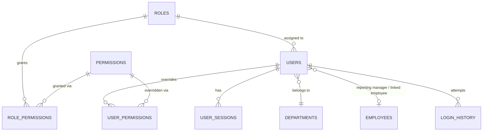
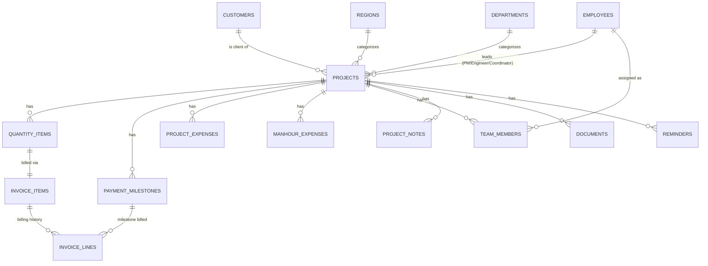
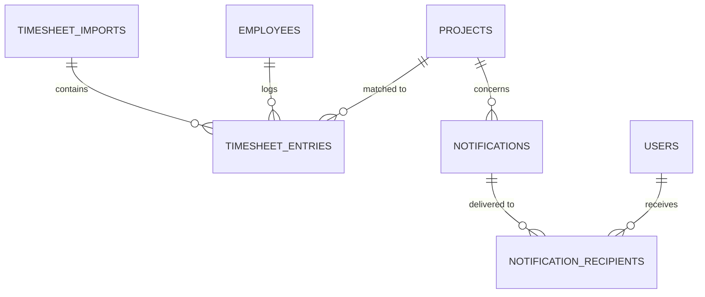

# iFluids PMO Portal
## PostgreSQL Database Design
### Version 1.0

**Builds on:** [Document 1 — Frontend Data Mapping & Architecture Blueprint](./01-Frontend-Data-Mapping-Architecture-Blueprint.md). Every table below traces back to a specific frontend model, service, or "Future SQL Table" reference named in that document.

**Design principle carried over from the frontend audit:** the current UI treats many fields as *always-recomputed, never-trusted-stale* (Doc 1, §"Auto Calculations" per module — e.g. `woValue`, `pendingQty`, `gstAmount`, milestone `amount`). This design **preserves that principle**: derived/aggregate values are modeled as **views**, not stored columns, unless the frontend itself explicitly snapshots a value at a point in time (e.g. an invoice line's `calculatedAmountINR`, which the frontend deliberately does *not* recalculate after save). Storing a derived value only where the source system itself snapshots it prevents the two most common causes of financial data drift.

---

## Table of Contents

1. [Naming Standards](#1-naming-standards)
2. [Enumerated Types](#2-enumerated-types)
3. [Reference / Master Data Tables](#3-reference--master-data-tables)
4. [Identity, Access & RBAC Tables](#4-identity-access--rbac-tables)
5. [Manpower Tables](#5-manpower-tables)
6. [Customer Tables](#6-customer-tables)
7. [Project Core Tables](#7-project-core-tables)
8. [Billing Tables (Quantity, Milestones, Invoices, Expenses)](#8-billing-tables-quantity-milestones-invoices-expenses)
9. [Timesheet Tables](#9-timesheet-tables)
10. [Notification & Reminder Tables](#10-notification--reminder-tables)
11. [Audit, Activity & Session Tables](#11-audit-activity--session-tables)
12. [Documents & Project Notes](#12-documents--project-notes)
13. [System Settings](#13-system-settings)
14. [Reporting Views (Dashboard/Reports Aggregates)](#14-reporting-views-dashboardreports-aggregates)
15. [ER Diagrams](#15-er-diagrams)
16. [Normalization Notes](#16-normalization-notes)
17. [Index Recommendations](#17-index-recommendations)
18. [Performance Recommendations](#18-performance-recommendations)

---

## 1. Naming Standards

- **Tables:** `snake_case`, plural (`projects`, `quantity_items`).
- **Primary keys:** `id UUID DEFAULT gen_random_uuid()` on every table (matches the frontend's universal `crypto.randomUUID()` convention — Doc 1 confirms every frontend model's `id` field is a UUID string).
- **Foreign keys:** `<referenced_table_singular>_id` (`project_id`, `employee_id`, `role_id`). Self-referencing FKs use a descriptive prefix (`reporting_manager_id REFERENCES employees(id)`).
- **Booleans:** prefixed `is_`/`has_` where it reads naturally (`is_read`, `is_archived`, `is_completed`), otherwise a plain adjective matching the frontend field name (`persistent`, `auto_resolve`) to minimize ORM-mapping friction with the existing TypeScript field names.
- **Timestamps:** `created_at`, `updated_at` — always `TIMESTAMPTZ`, never bare `TIMESTAMP`, since the frontend already stores everything as ISO-8601 strings with implicit UTC (`new Date().toISOString()`).
- **Money:** `NUMERIC(14, 2)` for INR amounts (up to 999,999,999,999.99 — comfortably covers Crore-scale work order values seen in the frontend's `formatCompactINR`). Non-INR currency amounts before conversion use `NUMERIC(14, 4)` to preserve FX precision.
- **Enums:** modeled as native Postgres `ENUM` types named `<concept>_status`/`<concept>_type`, reusing the frontend's exact string values (case-sensitive) so no translation layer is needed at the API boundary.
- **Soft state vs. hard delete:** the frontend today performs **hard deletes** everywhere (Customers, Employees, Projects, Users — Doc 1 confirms no soft-delete/archive exists in any delete flow). This design keeps hard deletes for parity, but every table that participates in Audit Logging should be deleted via an `ON DELETE` trigger that first writes a final `audit_logs` row (see §11) — a real backend should not silently lose the "who deleted what" fact the frontend currently has no way to record at all.

---

## 2. Enumerated Types

```sql
CREATE TYPE account_status        AS ENUM ('Active', 'Inactive');
CREATE TYPE employee_type         AS ENUM ('Permanent', 'Contract', 'Consultant', 'Intern');
CREATE TYPE domestic_foreign      AS ENUM ('Domestic', 'Foreign');
CREATE TYPE work_order_status     AS ENUM ('Received', 'Yet to Receive', 'Pending', 'Closed', 'Cancelled');
CREATE TYPE project_status        AS ENUM ('Active', 'Ongoing', 'Not Started', 'Completed', 'On Hold', 'Cancelled');
CREATE TYPE duration_unit         AS ENUM ('Days', 'Weeks', 'Months');
CREATE TYPE contract_type         AS ENUM ('LUMP SUM', 'ARC');
CREATE TYPE payment_type          AS ENUM ('Single', 'Multiple');
CREATE TYPE invoice_method        AS ENUM ('lump_sum', 'invoice_line_items');
CREATE TYPE invoice_line_status   AS ENUM ('Pending', 'Paid', 'Cancelled');
CREATE TYPE uom_type AS ENUM (
  'LUMP SUM', 'MAN-DAY', 'MAN-HOUR', 'DAY', 'MONTH', 'VISIT',
  'PERSON', 'JOB', 'PACKAGE', 'NOS', 'LOT', 'SET', 'TRIP'
);
CREATE TYPE team_member_status    AS ENUM ('Active', 'Released');
CREATE TYPE timesheet_import_type AS ENUM ('monthly', 'weekly');

CREATE TYPE reminder_priority AS ENUM ('Critical', 'High', 'Medium', 'Low');
CREATE TYPE reminder_status  AS ENUM ('Pending', 'Completed', 'Dismissed', 'Cancelled');
CREATE TYPE reminder_repeat  AS ENUM ('None', 'Daily', 'Weekly', 'Monthly', 'Yearly');
CREATE TYPE reminder_notify_offset AS ENUM (
  'At Due Time', '1 Minute Before', '5 Minutes Before', '10 Minutes Before',
  '30 Minutes Before', '1 Hour Before', '1 Day Before'
);

CREATE TYPE notification_category AS ENUM ('Critical', 'Warning', 'Information', 'Success');
CREATE TYPE notification_severity AS ENUM ('Critical', 'High', 'Medium', 'Low', 'Info');
CREATE TYPE notification_source AS ENUM (
  'Projects', 'Timesheets', 'Invoices', 'Payments', 'Expense Budget',
  'Dashboard', 'Documents', 'System', 'Reminders'
);
CREATE TYPE notification_audience AS ENUM (
  'Everyone', 'Administrator', 'Management', 'Project Manager',
  'Project Engineer', 'Finance', 'HR'
);
CREATE TYPE delivery_channel AS ENUM ('InApp', 'Toast', 'Email', 'Push', 'Teams', 'Slack');

CREATE TYPE audit_module AS ENUM (
  'Dashboard', 'Projects', 'Customer Master', 'Timesheets', 'Invoices',
  'Reports', 'Settings', 'User Management', 'Notifications'
);
CREATE TYPE audit_status AS ENUM ('Success', 'Warning', 'Failed');

CREATE TYPE document_category AS ENUM ('Report', 'Completion Certificate', 'Other');
CREATE TYPE permission_type   AS ENUM ('module_access', 'region_access', 'approval_right');
```

---

## 3. Reference / Master Data Tables

### `regions`
*Backs `UserProjectRegionAccess` (Doc 1 §4.12) and `Project.prCategory`'s implied geography.*

```sql
CREATE TABLE regions (
  id          UUID PRIMARY KEY DEFAULT gen_random_uuid(),
  code        TEXT NOT NULL UNIQUE,   -- 'india' | 'qatar' | 'malaysia' | 'oman' | 'abu_dhabi' | 'fzi' | 'elixir_qatar'
  name        TEXT NOT NULL,           -- 'India' | 'Qatar' | ...
  pr_prefix   TEXT,                    -- 'PR-' | 'MYPR-' | 'EE-' | 'PRAD-' | 'PRI-' | 'EE-Q-' | 'Q-PR-' (from PR_NUMBER_PREFIX_MAP)
  created_at  TIMESTAMPTZ NOT NULL DEFAULT now()
);
```
Seeded once with the 7 rows matching `PR_NUMBER_PREFIX_MAP` (Doc 1 §4.2) and `UserProjectRegionAccess` (Doc 1 §4.12) — the two frontend concepts must reference the same 7 values.

### `departments`
*Backs `DEFAULT_DEPARTMENTS` (Doc 1 §4.9) — the single canonical department list shared by Manpower, Projects, and User Management.*

```sql
CREATE TABLE departments (
  id          UUID PRIMARY KEY DEFAULT gen_random_uuid(),
  name        TEXT NOT NULL UNIQUE,
  is_default  BOOLEAN NOT NULL DEFAULT FALSE,  -- true for the 7 DEFAULT_DEPARTMENTS seed rows
  created_at  TIMESTAMPTZ NOT NULL DEFAULT now()
);
```
Replaces the frontend's `departmentDirectoryService.ts` in-memory merge-and-dedupe logic — `addDepartment()`'s "type to create a new one" flow becomes a plain `INSERT ... ON CONFLICT (name) DO NOTHING RETURNING *`.

### `currencies`

```sql
CREATE TABLE currencies (
  code   TEXT PRIMARY KEY,   -- 'INR' | 'USD' | 'EUR' | 'AED' | 'MYR' | 'QAR' | 'OMR'
  name   TEXT NOT NULL,
  symbol TEXT NOT NULL
);
```

### `exchange_rates`
*Backs `Project.contractExchangeRate` / `currentExchangeRate` (Doc 1 §4.2/§4.4) — a real FX history table, since the frontend today just stores one rate directly on the project with no audit trail of rate changes over time.*

```sql
CREATE TABLE exchange_rates (
  id             UUID PRIMARY KEY DEFAULT gen_random_uuid(),
  currency_code  TEXT NOT NULL REFERENCES currencies(code),
  rate_to_inr    NUMERIC(14, 6) NOT NULL,
  effective_date DATE NOT NULL,
  created_at     TIMESTAMPTZ NOT NULL DEFAULT now(),
  UNIQUE (currency_code, effective_date)
);
```

---

## 4. Identity, Access & RBAC Tables

### `roles`
*Backs `SystemRole` (Doc 1 §4.12/§6).*

```sql
CREATE TABLE roles (
  id          UUID PRIMARY KEY DEFAULT gen_random_uuid(),
  name        TEXT NOT NULL UNIQUE,  -- 'Administrator' | 'PMO Manager' | ... (the 10 SYSTEM_ROLES values)
  description TEXT,
  created_at  TIMESTAMPTZ NOT NULL DEFAULT now()
);
```

### `permissions`
*Backs the union of `UserModuleAccess` (11 keys) + `UserProjectRegionAccess` (7 keys) + `UserApprovalRights` (8 keys) — 26 rows total, tagged by `permission_type`.*

```sql
CREATE TABLE permissions (
  id              UUID PRIMARY KEY DEFAULT gen_random_uuid(),
  code            TEXT NOT NULL UNIQUE,   -- 'dashboard', 'qatar', 'approveInvoices', etc. — same string keys the frontend already uses
  permission_type permission_type NOT NULL,
  label           TEXT NOT NULL,
  created_at      TIMESTAMPTZ NOT NULL DEFAULT now()
);
```

### `role_permissions`
*Backs `ROLE_MODULE_DEFAULTS` / `ROLE_REGION_DEFAULTS` / `ROLE_APPROVAL_DEFAULTS` (Doc 1 §4.12/§2.9) — the default grant set applied only when a new user is created under a given role.*

```sql
CREATE TABLE role_permissions (
  role_id       UUID NOT NULL REFERENCES roles(id) ON DELETE CASCADE,
  permission_id UUID NOT NULL REFERENCES permissions(id) ON DELETE CASCADE,
  granted       BOOLEAN NOT NULL DEFAULT TRUE,
  PRIMARY KEY (role_id, permission_id)
);
```

### `users`
*Backs `User` (Doc 1 §6), currently pure in-memory/mock (`mockUsers.ts`, Doc 1 §4.12) — this is the table that must also become the real authentication principal (Doc 1 §2.2/§5's "Auth/User Management disconnect" gap).*

```sql
CREATE TABLE users (
  id                                    UUID PRIMARY KEY DEFAULT gen_random_uuid(),
  employee_id                           TEXT NOT NULL UNIQUE,        -- 'EMP-10001' style, auto-generated
  employee_name                        TEXT NOT NULL,
  email                                 TEXT NOT NULL UNIQUE,        -- Company Email — login identity
  password_hash                        TEXT,                        -- NULL only pre-first-login; see §"Auth flow" note below
  phone                                 TEXT,
  department_id                        UUID REFERENCES departments(id),
  designation                          TEXT NOT NULL,
  reporting_manager_id                  UUID REFERENCES employees(id),  -- see §16 Normalization Note #1
  employee_type_ref                     employee_type NOT NULL,
  role_id                               UUID NOT NULL REFERENCES roles(id),
  status                                account_status NOT NULL DEFAULT 'Active',
  avatar_url                            TEXT,

  -- Login Information
  temporary_password_hash               TEXT,               -- meaningful only while is_first_login = true
  is_first_login                        BOOLEAN NOT NULL DEFAULT TRUE,
  last_login_at                         TIMESTAMPTZ,

  -- Account Security (folded in as 1:1 columns — see §16 Normalization Note #2)
  force_password_change_on_first_login  BOOLEAN NOT NULL DEFAULT TRUE,
  account_locked                        BOOLEAN NOT NULL DEFAULT FALSE,
  two_factor_enabled                    BOOLEAN NOT NULL DEFAULT FALSE,
  password_expiry_days                  INTEGER,             -- NULL = "not enforced," matches frontend placeholder
  last_password_reset_at                TIMESTAMPTZ,

  -- Optional link to a Manpower employee record, if this portal user IS also a workforce employee
  employee_ref_id                       UUID REFERENCES employees(id),

  -- Account Information (audit)
  created_at                            TIMESTAMPTZ NOT NULL DEFAULT now(),
  created_by                            UUID REFERENCES users(id),
  last_modified_at                      TIMESTAMPTZ
);
```

**Auth flow note:** the frontend's `generateTemporaryPassword()` always returns the literal `"Welcome@123"` (Doc 1 §4.12) — this is acceptable as *mock* behavior but **must never reach the real backend as plaintext**. The real implementation stores only `password_hash`/`temporary_password_hash` (bcrypt/argon2), and the temporary password value itself is returned exactly once in the `POST /api/users` response body (Doc 3) and never persisted or logged anywhere in plaintext.

### `user_permissions`
*Per-user override table — models the frontend behavior where an Administrator can hand-tune an individual user's Module/Region/Approval grants beyond their role's defaults (Doc 1 §4.12: "Edit mode never silently overwrites a customized user's permissions"). A user's **effective** permission = the row here if one exists for that (user, permission) pair, else the `role_permissions` default for their `role_id`.*

```sql
CREATE TABLE user_permissions (
  user_id       UUID NOT NULL REFERENCES users(id) ON DELETE CASCADE,
  permission_id UUID NOT NULL REFERENCES permissions(id) ON DELETE CASCADE,
  granted       BOOLEAN NOT NULL,
  PRIMARY KEY (user_id, permission_id)
);
```

### `user_sessions`
*New table — real session/JWT tracking, replacing the frontend's single `localStorage["pmo_auth_session"]` (Doc 1 §2.2/§2.5).*

```sql
CREATE TABLE user_sessions (
  id           UUID PRIMARY KEY DEFAULT gen_random_uuid(),
  user_id      UUID NOT NULL REFERENCES users(id) ON DELETE CASCADE,
  token_hash   TEXT NOT NULL UNIQUE,   -- SHA-256 of the refresh token, never the raw token
  ip_address   INET,
  user_agent   TEXT,
  created_at   TIMESTAMPTZ NOT NULL DEFAULT now(),
  expires_at   TIMESTAMPTZ NOT NULL,
  revoked_at   TIMESTAMPTZ
);
```

---

## 5. Manpower Tables

### `employees`
*Backs `Employee` (Doc 1 §4.9/§6).*

```sql
CREATE TABLE employees (
  id                    UUID PRIMARY KEY DEFAULT gen_random_uuid(),
  employee_no           TEXT NOT NULL UNIQUE,    -- immutable once created, per Doc 1 §4.9
  employee_name         TEXT NOT NULL,
  designation           TEXT NOT NULL,
  department_id         UUID REFERENCES departments(id),
  location              TEXT NOT NULL,
  reporting_manager_id  UUID REFERENCES employees(id),  -- self-referencing; see §16 Normalization Note #1
  grade                 TEXT NOT NULL,
  manhour_rate          NUMERIC(10, 2) NOT NULL DEFAULT 0,   -- Employee.manhourExpenses
  status                account_status NOT NULL DEFAULT 'Active',
  created_at            TIMESTAMPTZ NOT NULL DEFAULT now()
);
```

---

## 6. Customer Tables

### `customers`
*Backs `Customer` (Doc 1 §4.8/§6).*

```sql
CREATE TABLE customers (
  id              UUID PRIMARY KEY DEFAULT gen_random_uuid(),
  customer_code   TEXT UNIQUE,             -- optional org-assigned code (Customer.customerId)
  customer_name   TEXT NOT NULL UNIQUE,    -- the uniqueness key enforced by customerService.ts today
  company_name    TEXT,
  country         TEXT,
  contact_person  TEXT,
  email           TEXT CHECK (email IS NULL OR email ~* '^[^\s@]+@[^\s@]+\.[^\s@]+$'),
  phone           TEXT,
  status          account_status NOT NULL DEFAULT 'Active',
  created_at      TIMESTAMPTZ NOT NULL DEFAULT now(),
  updated_at      TIMESTAMPTZ
);
```
The `CHECK` constraint formalizes the frontend's `EMAIL_PATTERN` regex (Doc 1 §4.8) at the database layer as a defense-in-depth measure, not a replacement for API-layer validation.

---

## 7. Project Core Tables

### `projects`
*Backs `Project` (Doc 1 §4.2/§6) — the largest and most central table. **Derived fields are deliberately excluded** (see the callout above §1) — `totalWOQty`, `totalInvoiceQty`, `totalPendingQty`, `pendingAmount`, `pendingInvoicePercentage`, `gstAmount`, `grandTotal`, `workOrderValue`/`workOrderValueINR`, and every payment-milestone `amount` are all recomputed by the views in §14, never stored here.*

```sql
CREATE TABLE projects (
  id                        UUID PRIMARY KEY DEFAULT gen_random_uuid(),

  -- General Information
  po_month                  DATE NOT NULL,             -- stored as first-of-month; frontend's "YYYY-MM"
  region_id                 UUID NOT NULL REFERENCES regions(id),   -- Project.prCategory
  pr_no                     TEXT NOT NULL UNIQUE,       -- ⚠ NOT enforced anywhere in the current frontend UI — see Doc 1 §5
  client_id                 UUID NOT NULL REFERENCES customers(id), -- see §16 Normalization Note #3
  department_id             UUID REFERENCES departments(id),
  domestic_foreign           domestic_foreign NOT NULL,
  project_title             TEXT NOT NULL,
  work_order_status          work_order_status NOT NULL,
  project_start_date         DATE NOT NULL,
  project_end_date           DATE,
  project_status             project_status NOT NULL,
  work_order_number          TEXT,
  work_order_date            DATE,
  eic_name                   TEXT,
  contact_number             TEXT,
  email_id                   TEXT,
  estimated_duration          INTEGER,
  duration_unit               duration_unit,

  -- Commercial
  currency_code               TEXT NOT NULL REFERENCES currencies(code) DEFAULT 'INR',
  contract_exchange_rate      NUMERIC(14, 6) NOT NULL DEFAULT 1,
  current_exchange_rate       NUMERIC(14, 6) NOT NULL DEFAULT 1,
  contract_type                contract_type NOT NULL,
  contract_formalities         TEXT,
  payment_terms                 TEXT,

  gst_applicable                BOOLEAN NOT NULL DEFAULT FALSE,
  gst_rate_percent               NUMERIC(5, 2) NOT NULL DEFAULT 18.00,   -- fixed today, kept configurable for the future

  payment_type                   payment_type NOT NULL DEFAULT 'Single',
  invoice_method                 invoice_method,       -- NULL = "not yet chosen," matches frontend gate

  -- Project Team
  primary_project_manager_id     UUID NOT NULL REFERENCES employees(id),
  secondary_project_manager_id    UUID REFERENCES employees(id),
  project_engineer_id            UUID REFERENCES employees(id),
  project_coordinator_id          UUID REFERENCES employees(id),
  pmo_coordinator_id              UUID REFERENCES employees(id),
  client_coordinator               TEXT,

  -- Expense Budget (kept flat on projects — 1:1 attributes, no independent lifecycle; see §16 Note #4)
  manhour_budget_amount            NUMERIC(14, 2),
  manhour_budget_hours              NUMERIC(10, 2),
  manhour_budget_remarks             TEXT,
  non_manhour_budget_amount          NUMERIC(14, 2),
  non_manhour_budget_remarks          TEXT,

  -- Documents (simple link fields kept for parity; see documents table, §12, for real file management)
  report_link                        TEXT,
  completion_certificate              TEXT,
  project_completion_date             DATE,

  client_reference_no                  TEXT,
  remarks                              TEXT,

  created_at                           TIMESTAMPTZ NOT NULL DEFAULT now(),
  created_by                           UUID REFERENCES users(id),
  updated_at                           TIMESTAMPTZ
);
```

---

## 8. Billing Tables (Quantity, Milestones, Invoices, Expenses)

### `quantity_items`
*Backs `QuantityItem` (Doc 1 §4.4/§6). `unitRateINR`, `woValue`, `pendingQty`, `pendingAmount` are views, not columns — see §14.*

```sql
CREATE TABLE quantity_items (
  id              UUID PRIMARY KEY DEFAULT gen_random_uuid(),
  project_id      UUID NOT NULL REFERENCES projects(id) ON DELETE CASCADE,
  description     TEXT NOT NULL,
  wo_qty          NUMERIC(14, 2) NOT NULL CHECK (wo_qty > 0),
  invoice_qty     NUMERIC(14, 2) NOT NULL DEFAULT 0,  -- legacy/compat, see Doc 1 §4.4
  uom             uom_type NOT NULL,
  assigned_to_id  UUID REFERENCES employees(id),
  currency_code   TEXT NOT NULL REFERENCES currencies(code),
  unit_rate       NUMERIC(14, 4) NOT NULL CHECK (unit_rate > 0),
  exchange_rate   NUMERIC(14, 6) NOT NULL DEFAULT 1,
  sort_order      INTEGER NOT NULL DEFAULT 0
);
```

### `payment_milestones`
*Backs `Project.paymentMilestones` (Doc 1 §4.5/§6). `amount` is a view — see §14.*

```sql
CREATE TABLE payment_milestones (
  id                   UUID PRIMARY KEY DEFAULT gen_random_uuid(),
  project_id           UUID NOT NULL REFERENCES projects(id) ON DELETE CASCADE,
  milestone_name       TEXT,
  payment_percentage   NUMERIC(5, 2) NOT NULL CHECK (payment_percentage > 0),
  due_date             DATE NOT NULL,
  sort_order           INTEGER NOT NULL DEFAULT 0
);
```
**Recommended new constraint** (not enforced by the frontend today, per Doc 1 §5): a deferred trigger validating `SUM(payment_percentage) = 100` per `project_id` whenever `payment_type = 'Multiple'` and the milestone set is considered final/saved — recommended as a data-quality improvement, not a strict blocker, matching the frontend's own "warn, don't block" stance.

### `invoice_items`
*Backs `InvoiceItem` (Doc 1 §4.7/§6) — one row per Quantity activity's billing container.*

```sql
CREATE TABLE invoice_items (
  id                 UUID PRIMARY KEY DEFAULT gen_random_uuid(),
  project_id         UUID NOT NULL REFERENCES projects(id) ON DELETE CASCADE,
  quantity_item_id   UUID NOT NULL REFERENCES quantity_items(id) ON DELETE CASCADE,
  created_at         TIMESTAMPTZ NOT NULL DEFAULT now(),
  UNIQUE (quantity_item_id)   -- 1:1 with the Quantity row it mirrors, per invoiceSyncService.ts
);
```

### `invoice_lines`
*Backs `InvoiceLine` (Doc 1 §4.7/§6) — the actual billing transaction history. `calculated_amount_inr` and `commercial_adjustment_inr` ARE stored (not views) because the frontend explicitly snapshots them at save time and never live-recalculates afterward (Doc 1 §4.7) — this is the one place in the whole schema where a "derived" value is intentionally persisted, to match that exact frontend behavior.*

```sql
CREATE TABLE invoice_lines (
  id                          UUID PRIMARY KEY DEFAULT gen_random_uuid(),
  invoice_item_id             UUID NOT NULL REFERENCES invoice_items(id) ON DELETE CASCADE,
  payment_milestone_id        UUID REFERENCES payment_milestones(id),   -- set only for Commercial Milestone billing
  invoice_no                  TEXT NOT NULL,     -- the cycle label, e.g. 'PR-11040-INV-003'
  invoice_date                DATE NOT NULL,
  qty_billed                  NUMERIC(14, 2) NOT NULL,
  unit_price_inr               NUMERIC(14, 4) NOT NULL,
  milestone_percent            NUMERIC(5, 2) NOT NULL DEFAULT 100,
  calculated_amount_inr         NUMERIC(14, 2) NOT NULL,   -- snapshotted at save
  invoice_amount_inr            NUMERIC(14, 2) NOT NULL,   -- may differ from calculated (Commercial Adjustment)
  commercial_adjustment_inr      NUMERIC(14, 2) NOT NULL DEFAULT 0,
  status                        invoice_line_status NOT NULL DEFAULT 'Pending',
  created_at                    TIMESTAMPTZ NOT NULL DEFAULT now(),
  created_by                    UUID REFERENCES users(id)
);
```

### `project_expenses`
*Backs `NonManhourExpense` ("Other Project Expenses," Doc 1 §4.6/§6). `total_cost` is a view — see §14.*

```sql
CREATE TABLE project_expenses (
  id           UUID PRIMARY KEY DEFAULT gen_random_uuid(),
  project_id   UUID NOT NULL REFERENCES projects(id) ON DELETE CASCADE,
  category     TEXT NOT NULL,
  description  TEXT,
  quantity     NUMERIC(14, 2) NOT NULL DEFAULT 1,
  unit_cost    NUMERIC(14, 2) NOT NULL DEFAULT 0,
  remarks      TEXT,
  created_at   TIMESTAMPTZ NOT NULL DEFAULT now()
);
```

### `manhour_expenses`
*Backs `ManhourExpense` (Doc 1 §4.6/§6) — modeled even though the current frontend UI has no entry point to it (a real, if currently orphaned, model + service function exists). `total_cost` is a view.*

```sql
CREATE TABLE manhour_expenses (
  id             UUID PRIMARY KEY DEFAULT gen_random_uuid(),
  project_id     UUID NOT NULL REFERENCES projects(id) ON DELETE CASCADE,
  employee_id    UUID NOT NULL REFERENCES employees(id),
  manhour_rate   NUMERIC(10, 2) NOT NULL,
  booked_hours   NUMERIC(10, 2) NOT NULL DEFAULT 0,
  remarks        TEXT,
  created_at     TIMESTAMPTZ NOT NULL DEFAULT now()
);
```

### `team_members`
*Formalizes Team Assigned (Doc 1 §4.3) as a real assignment table — **recommended new design**, since the frontend's own `project.resources[]` field is legacy/unused and the live UI derives "who's on the project" purely by joining Timesheet entries to a PR Number at read time (Doc 1 §4.3/§5). A real backend should decide explicitly whether to keep that pure-derivation model or formalize assignment as its own table; this design recommends the latter for query performance and to support assigning someone *before* their first timesheet exists. Actual hours/cost still come from `timesheet_entries`, never duplicated here.*

```sql
CREATE TABLE team_members (
  id           UUID PRIMARY KEY DEFAULT gen_random_uuid(),
  project_id   UUID NOT NULL REFERENCES projects(id) ON DELETE CASCADE,
  employee_id  UUID NOT NULL REFERENCES employees(id),
  start_date   DATE NOT NULL,
  end_date     DATE,
  status       team_member_status NOT NULL DEFAULT 'Active',
  created_at   TIMESTAMPTZ NOT NULL DEFAULT now(),
  UNIQUE (project_id, employee_id)
);
```

---

## 9. Timesheet Tables

### `timesheet_imports`
*Backs `TimesheetImportMonth` (Doc 1 §4.10/§6).*

```sql
CREATE TABLE timesheet_imports (
  id           UUID PRIMARY KEY DEFAULT gen_random_uuid(),
  month        DATE NOT NULL,                -- first-of-month; the dormant weekly format (Doc 1 §5) is not modeled
  import_type  timesheet_import_type NOT NULL DEFAULT 'monthly',
  uploaded_at  TIMESTAMPTZ NOT NULL DEFAULT now(),
  uploaded_by  UUID REFERENCES users(id)
);
```

### `timesheet_entries`
*Backs `TimesheetEntry` (Doc 1 §4.10/§6) — the raw, per-day audit trail. `project_id`/`employee_id` are matched via the PR-Number normalization logic (`normalizeProjectCode`, Doc 1 §4.3/§4.10) at import time and stored as resolved FKs, with the raw imported text preserved alongside for audit/debugging.*

```sql
CREATE TABLE timesheet_entries (
  id                 UUID PRIMARY KEY DEFAULT gen_random_uuid(),
  import_id          UUID NOT NULL REFERENCES timesheet_imports(id) ON DELETE CASCADE,
  employee_id        UUID REFERENCES employees(id),          -- NULL if no match found at import time
  employee_no_raw    TEXT NOT NULL,
  project_id         UUID REFERENCES projects(id),            -- NULL if no PR-Number match found
  project_code_raw   TEXT NOT NULL,
  project_name_raw   TEXT,
  entry_date         DATE NOT NULL,
  task               TEXT,
  hours              NUMERIC(6, 2) NOT NULL CHECK (hours >= 0),
  status             team_member_status,     -- reuses Active/Released, matches TimesheetEntry.status
  created_at         TIMESTAMPTZ NOT NULL DEFAULT now(),
  UNIQUE (employee_no_raw, project_code_raw, entry_date)   -- the frontend's own duplicate-import guard, Doc 1 §4.10
);
```

---

## 10. Notification & Reminder Tables

### `notifications`
*Backs `PMONotification` (Doc 1 §4.14/§6). **Recommended change from the frontend's current shape** (see §16 Note #5): `is_read`/`is_archived` move off the notification itself and onto a `notification_recipients` join table, since a real multi-user backend needs per-user read state — the current frontend has a single shared read/archived flag because it only ever has one logged-in user.*

```sql
CREATE TABLE notifications (
  id                UUID PRIMARY KEY DEFAULT gen_random_uuid(),
  rule_id           TEXT NOT NULL,     -- 'HRS_OVERRUN', 'REMINDER_TRIGGER', etc.
  version           INTEGER NOT NULL DEFAULT 1,
  title             TEXT NOT NULL,
  message           TEXT NOT NULL,
  category          notification_category NOT NULL,
  severity          notification_severity NOT NULL,
  source            notification_source NOT NULL,
  target_audience   notification_audience NOT NULL,
  delivery_channels delivery_channel[] NOT NULL DEFAULT '{}',
  module            TEXT,
  project_id        UUID REFERENCES projects(id),
  project_code      TEXT,
  persistent        BOOLEAN NOT NULL,   -- true = Event, false = auto-resolving Rule
  auto_resolve      BOOLEAN NOT NULL,
  action_label      TEXT,
  action_route      TEXT,
  action_state      JSONB,
  metadata          JSONB,
  created_at        TIMESTAMPTZ NOT NULL DEFAULT now()
);

CREATE TABLE notification_recipients (
  notification_id  UUID NOT NULL REFERENCES notifications(id) ON DELETE CASCADE,
  user_id          UUID NOT NULL REFERENCES users(id) ON DELETE CASCADE,
  is_read          BOOLEAN NOT NULL DEFAULT FALSE,
  is_archived      BOOLEAN NOT NULL DEFAULT FALSE,
  delivered_at     TIMESTAMPTZ NOT NULL DEFAULT now(),
  PRIMARY KEY (notification_id, user_id)
);
```

### `reminders`
*Backs `ProjectReminder` (Doc 1 §4.15/§6).*

```sql
CREATE TABLE reminders (
  id                    UUID PRIMARY KEY DEFAULT gen_random_uuid(),
  project_id            UUID NOT NULL REFERENCES projects(id) ON DELETE CASCADE,
  title                 TEXT NOT NULL,
  description           TEXT,
  reminder_type         TEXT NOT NULL,
  priority              reminder_priority NOT NULL,
  status                reminder_status NOT NULL DEFAULT 'Pending',
  reminder_date         DATE NOT NULL,
  reminder_time         TIME NOT NULL,
  notify_offset         reminder_notify_offset NOT NULL DEFAULT 'At Due Time',
  repeat_rule           reminder_repeat NOT NULL DEFAULT 'None',
  created_by            UUID NOT NULL REFERENCES users(id),
  created_date          TIMESTAMPTZ NOT NULL DEFAULT now(),
  completed_date        TIMESTAMPTZ,
  is_completed          BOOLEAN NOT NULL DEFAULT FALSE,
  notification_generated BOOLEAN NOT NULL DEFAULT FALSE,
  triggered_at          TIMESTAMPTZ,
  metadata              JSONB
);
```

---

## 11. Audit, Activity & Session Tables

### `audit_logs`
*Backs `AuditLogItem` (Doc 1 §4.13/§6) — **and, unlike today's frontend, must actually be written to on every real mutation** (Doc 1 §4.13/§5 flags the current implementation as 100% synthetic/disconnected). This is the schema; Document 3 must specify the middleware that populates it.*

```sql
CREATE TABLE audit_logs (
  id                UUID PRIMARY KEY DEFAULT gen_random_uuid(),
  "timestamp"       TIMESTAMPTZ NOT NULL DEFAULT now(),
  user_id           UUID REFERENCES users(id),
  employee_name     TEXT NOT NULL,
  employee_id       TEXT NOT NULL,
  company_email     TEXT NOT NULL,
  department        TEXT,
  role              TEXT,
  module            audit_module NOT NULL,
  action            TEXT NOT NULL,
  reference_no      TEXT,
  affected_record    TEXT,
  ip_address        INET,
  device            TEXT,
  browser           TEXT,
  operating_system  TEXT,
  location          TEXT,
  session_id        TEXT,
  status            audit_status NOT NULL,
  description       TEXT,
  failure_reason    TEXT
);

CREATE TABLE audit_log_timeline_steps (
  id            UUID PRIMARY KEY DEFAULT gen_random_uuid(),
  audit_log_id  UUID NOT NULL REFERENCES audit_logs(id) ON DELETE CASCADE,
  step_order    INTEGER NOT NULL,
  label         TEXT NOT NULL,
  "timestamp"   TIMESTAMPTZ NOT NULL,
  status        audit_status NOT NULL
);
```

### `login_history`
*Backs `FailedLoginRecord` (Doc 1 §4.13/§6), broadened to record every login attempt (success and failure), which the current frontend's synthetic data does not truly do.*

```sql
CREATE TABLE login_history (
  id                 UUID PRIMARY KEY DEFAULT gen_random_uuid(),
  user_id            UUID REFERENCES users(id),         -- NULL if the attempted employee_id doesn't exist
  employee_id_attempted TEXT NOT NULL,
  success            BOOLEAN NOT NULL,
  ip_address         INET,
  user_agent         TEXT,
  location           TEXT,
  failure_reason     TEXT,
  created_at         TIMESTAMPTZ NOT NULL DEFAULT now()
);
```

### `activity_logs`
*Backs the Dashboard's "Recent Activity" feed (Doc 1 §4.1's `ActivityFeed`/`getRecentActivity()`) — the frontend currently **synthesizes** this list at read time from `createdAt`/`updatedAt`/notes/invoices on every render. Formalizing it as a real event-sourced table (write once, read many) is a recommended performance improvement, distinct in purpose from `audit_logs` (security/compliance trail) — this table is product-facing activity, not a security record.*

```sql
CREATE TABLE activity_logs (
  id           UUID PRIMARY KEY DEFAULT gen_random_uuid(),
  project_id   UUID REFERENCES projects(id) ON DELETE CASCADE,
  event_type   TEXT NOT NULL,     -- 'Project Created' | 'Project Updated' | 'Note Added' | 'Invoice Raised' | 'Payment Received'
  description  TEXT NOT NULL,
  amount_inr   NUMERIC(14, 2),    -- populated for Invoice Raised / Payment Received events
  actor_id     UUID REFERENCES users(id),
  occurred_at  TIMESTAMPTZ NOT NULL DEFAULT now()
);
```

---

## 12. Documents & Project Notes

### `documents`
*Requested master table for file management — the current frontend has no real upload flow, only two flat text-link fields on `Project` (`reportLink`, `completionCertificate` — Doc 1 §4.2/§6). This table is forward-looking, sized for when real file upload is built.*

```sql
CREATE TABLE documents (
  id            UUID PRIMARY KEY DEFAULT gen_random_uuid(),
  project_id    UUID REFERENCES projects(id) ON DELETE CASCADE,
  file_name     TEXT NOT NULL,
  file_url      TEXT NOT NULL,
  file_type     TEXT,
  category      document_category NOT NULL DEFAULT 'Other',
  uploaded_by   UUID REFERENCES users(id),
  uploaded_at   TIMESTAMPTZ NOT NULL DEFAULT now()
);
```

### `project_notes`
*Backs `ProjectNote` (Doc 1 §6) — the Workspace drawer's notes timeline (Doc 1 §4.2).*

```sql
CREATE TABLE project_notes (
  id          UUID PRIMARY KEY DEFAULT gen_random_uuid(),
  project_id  UUID NOT NULL REFERENCES projects(id) ON DELETE CASCADE,
  note_text   TEXT NOT NULL,
  created_by  UUID REFERENCES users(id),
  created_at  TIMESTAMPTZ NOT NULL DEFAULT now()
);
```

---

## 13. System Settings

*Backs the Settings → "System Preferences" placeholder tab (Doc 1 §4.12 — currently a static UI card with no real settings). A simple key/value table is deliberately chosen over a rigid columns-per-setting table, since the frontend has not yet defined what belongs here.*

```sql
CREATE TABLE system_settings (
  key         TEXT PRIMARY KEY,
  value       JSONB NOT NULL,
  updated_at  TIMESTAMPTZ NOT NULL DEFAULT now(),
  updated_by  UUID REFERENCES users(id)
);
```

---

## 14. Reporting Views (Dashboard/Reports Aggregates)

These views replace the frontend's client-side recomputation (`normalizeProject()`, `calculateQuantity()`, `getProjectCommercialSummary()`, `dashboardService.ts` — all cited in Doc 1) with server-side SQL, so every consumer (Dashboard, Reports, Projects Repository) reads the **same** numbers instead of re-deriving them independently.

```sql
-- Per-Quantity-Item derived amounts (QuantityItem's unitRateINR/woValue/pendingQty/pendingAmount, Doc 1 §4.4)
CREATE VIEW v_quantity_item_amounts AS
SELECT
  qi.*,
  CASE WHEN qi.currency_code = 'INR' THEN qi.unit_rate ELSE qi.unit_rate * qi.exchange_rate END AS unit_rate_inr,
  CASE
    WHEN qi.uom = 'LUMP SUM' THEN (CASE WHEN qi.currency_code = 'INR' THEN qi.unit_rate ELSE qi.unit_rate * qi.exchange_rate END)
    ELSE qi.wo_qty * (CASE WHEN qi.currency_code = 'INR' THEN qi.unit_rate ELSE qi.unit_rate * qi.exchange_rate END)
  END AS wo_value,
  GREATEST(
    (CASE WHEN qi.uom = 'LUMP SUM' THEN 1 ELSE qi.wo_qty END) - qi.invoice_qty,
    0
  ) AS pending_qty
FROM quantity_items qi;

-- Per-Payment-Milestone derived amount (Doc 1 §4.5)
CREATE VIEW v_payment_milestone_amounts AS
SELECT
  pm.*,
  p.work_order_value_inr * pm.payment_percentage / 100.0 AS amount
FROM payment_milestones pm
JOIN v_project_totals p ON p.id = pm.project_id;

-- Per-Project commercial rollup (Project.totalWOQty/workOrderValueINR/gstAmount/grandTotal etc., Doc 1 §4.4/§4.2)
CREATE VIEW v_project_totals AS
SELECT
  pr.id,
  COALESCE(SUM(qia.wo_qty), 0)                                              AS total_wo_qty,
  COALESCE(SUM(qia.invoice_qty), 0)                                          AS total_invoice_qty,
  COALESCE(SUM(qia.pending_qty), 0)                                          AS total_pending_qty,
  COALESCE(SUM(qia.pending_qty * qia.unit_rate_inr), 0)                      AS pending_amount,
  COALESCE(SUM(qia.wo_value), 0)                                             AS work_order_value_inr,
  CASE WHEN pr.gst_applicable AND pr.currency_code = 'INR'
       THEN COALESCE(SUM(qia.wo_value), 0) * pr.gst_rate_percent / 100.0
       ELSE 0 END                                                           AS gst_amount,
  COALESCE(SUM(qia.wo_value), 0)
    + CASE WHEN pr.gst_applicable AND pr.currency_code = 'INR'
           THEN COALESCE(SUM(qia.wo_value), 0) * pr.gst_rate_percent / 100.0
           ELSE 0 END                                                       AS grand_total
FROM projects pr
LEFT JOIN v_quantity_item_amounts qia ON qia.project_id = pr.id
GROUP BY pr.id, pr.gst_applicable, pr.currency_code, pr.gst_rate_percent;

-- Per-Project commercial summary (Doc 1 §4.7's getProjectCommercialSummary — used by Dashboard, Repository, View Project, Reports)
CREATE VIEW v_project_commercial_summary AS
SELECT
  pr.id AS project_id,
  vt.work_order_value_inr AS project_value_inr,
  COALESCE(SUM(il.invoice_amount_inr) FILTER (WHERE il.status <> 'Cancelled'), 0) AS total_invoice_raised,
  GREATEST(vt.work_order_value_inr - COALESCE(SUM(il.invoice_amount_inr) FILTER (WHERE il.status <> 'Cancelled'), 0), 0) AS pending_due,
  COALESCE(SUM(il.invoice_amount_inr) FILTER (WHERE il.status = 'Paid'), 0) AS total_payment_received,
  GREATEST(
    COALESCE(SUM(il.invoice_amount_inr) FILTER (WHERE il.status <> 'Cancelled'), 0)
      - COALESCE(SUM(il.invoice_amount_inr) FILTER (WHERE il.status = 'Paid'), 0),
    0
  ) AS outstanding_collection
FROM projects pr
JOIN v_project_totals vt ON vt.id = pr.id
LEFT JOIN invoice_items ii ON ii.project_id = pr.id
LEFT JOIN invoice_lines il ON il.invoice_item_id = ii.id
GROUP BY pr.id, vt.work_order_value_inr;

-- Per-Project expense/profit rollup (expenseService.ts, Doc 1 §4.6)
CREATE VIEW v_project_expense_summary AS
SELECT
  pr.id AS project_id,
  COALESCE(SUM(pe.quantity * pe.unit_cost), 0)                     AS total_non_manhour_actual,
  COALESCE(SUM(me.booked_hours * me.manhour_rate), 0)              AS total_manhour_actual,
  pr.manhour_budget_amount + pr.non_manhour_budget_amount          AS total_project_cost_budgeted,
  vt.work_order_value_inr - (pr.manhour_budget_amount + pr.non_manhour_budget_amount) AS budgeted_profit
FROM projects pr
JOIN v_project_totals vt ON vt.id = pr.id
LEFT JOIN project_expenses pe ON pe.project_id = pr.id
LEFT JOIN manhour_expenses me ON me.project_id = pr.id
GROUP BY pr.id, pr.manhour_budget_amount, pr.non_manhour_budget_amount, vt.work_order_value_inr;

-- Per-Project, per-Employee timesheet rollup (timesheetProcessingService.ts's getProcessedTeamMembers, Doc 1 §4.3)
CREATE VIEW v_project_team_hours AS
SELECT
  te.project_id,
  te.employee_id,
  COUNT(DISTINCT te.entry_date)          AS working_days,
  SUM(te.hours)                          AS total_hours,
  SUM(te.hours) * e.manhour_rate         AS total_cost,
  SUM(te.hours) / NULLIF(COUNT(DISTINCT te.entry_date), 0) AS average_hours_per_day
FROM timesheet_entries te
JOIN employees e ON e.id = te.employee_id
WHERE te.project_id IS NOT NULL AND te.employee_id IS NOT NULL
GROUP BY te.project_id, te.employee_id, e.manhour_rate;

-- Which (project, month) combinations have at least one submitted timesheet
-- (getProcessedProjectMonths, Doc 1 §4.3/§4.10 — the canonical matcher shared by Team Assigned AND Timesheet Pending)
CREATE VIEW v_project_submitted_months AS
SELECT DISTINCT
  te.project_id,
  date_trunc('month', te.entry_date)::date AS submitted_month
FROM timesheet_entries te
WHERE te.project_id IS NOT NULL;
```

**Dashboard/Reports-level aggregates** (hours overrun, timeline alerts, team leads workload, timesheet pending, health summary, department summary, top clients, recent activity, recent projects — Doc 1 §4.1's full widget table) are **intentionally not modeled as stored views** here: each depends on "today's date" (a query-time constant, not data), so they are better implemented as parameterized queries inside the `DashboardAggregationService` (Doc 3) than as views that would need daily refreshing. The five views above are the stable, date-independent building blocks those queries compose from.

---

## 15. ER Diagrams

### 15.1 Identity & Access



### 15.2 Projects & Billing



### 15.3 Timesheets & Notifications



---

## 16. Normalization Notes

1. **`reporting_manager_id` as a real FK, not free text.** The frontend stores `reportingManager` as a plain string on both `Employee` and `User` (Doc 1 §4.9/§4.12), sourced from a dynamically-derived, deduplicated name list (`reportingManagerDirectoryService.ts`). This design normalizes it into a real self-referencing FK on `employees` (and a FK from `users` to `employees`) so a manager rename doesn't require updating every row that references their name, and so "reporting manager" always resolves to a real employee record — eliminating the frontend's current risk of a typo or casing variant silently creating a phantom manager name.

2. **Account Security folded into `users` rather than a separate table.** The frontend groups these fields under a distinct "Account Security" UI section (`UserAccountSecurity` interface, Doc 1 §6), but they are 1:1, always-present attributes of a user with no independent lifecycle — a separate table would only add a join with no normalization benefit.

3. **`projects.client_id` as a real FK to `customers`, not a free-text name.** The frontend's `Project.client` is a plain string (Doc 1 §6), populated from an autocomplete against Customer Master but not enforced as a hard reference. This design closes that gap — every project must reference a real `customers` row, preventing the silent client-name drift (e.g. "HPCL" vs. "H.P.C.L.") that free text allows today.

4. **Expense Budget fields kept flat on `projects`, not a separate `expense_budgets` table.** These are 1:1 attributes (one budget per project) with no independent identity or lifecycle of their own — same reasoning as Note 2.

5. **`notifications`/`is_read`/`is_archived` split into a `notification_recipients` join table.** The current frontend has exactly one logged-in user at a time, so a single shared `isRead`/`isArchived` flag per notification (Doc 1 §6) is sufficient. A real multi-user backend needs per-user read/archived state — this is the one place this design's shape **diverges** from the frontend's current data model, and Document 3's API layer should account for it (a `GET /api/notifications` response is always scoped to the requesting user via this join).

6. **`team_members` formalized as a real table instead of remaining a pure Timesheet-derived view.** Doc 1 §4.3/§5 explicitly flags that the frontend's live Team Assigned view has *no* stored assignment record at all — it's entirely computed from Timesheet PR-Number matching, with the actual `project.resources` field sitting unused. This design recommends formalizing assignment (who is *intended* to be on a project) as its own table, while keeping actual hours/cost as a computed join against `timesheet_entries` — preserving the frontend's "never let two views disagree" principle while still letting a PM assign someone before their first timesheet exists.

7. **PR Number, Customer Name, and Employee Number uniqueness are now real database constraints**, closing three explicit gaps called out in Doc 1 §5 where today's frontend UI does not enforce uniqueness on manual entry (only on Excel import, and inconsistently).

---

## 17. Index Recommendations

```sql
-- High-frequency lookups by business key
CREATE INDEX idx_projects_pr_no            ON projects (pr_no);
CREATE INDEX idx_projects_status           ON projects (project_status);
CREATE INDEX idx_projects_client           ON projects (client_id);
CREATE INDEX idx_projects_department       ON projects (department_id);
CREATE INDEX idx_projects_end_date         ON projects (project_end_date) WHERE project_status IN ('Active','Ongoing');

-- Quantity/Invoice joins (heaviest read path — Dashboard, Reports, Repository all hit these)
CREATE INDEX idx_quantity_items_project    ON quantity_items (project_id);
CREATE INDEX idx_invoice_items_project     ON invoice_items (project_id);
CREATE INDEX idx_invoice_lines_item        ON invoice_lines (invoice_item_id);
CREATE INDEX idx_invoice_lines_status      ON invoice_lines (status) WHERE status <> 'Cancelled';

-- Timesheet matching — the single most performance-sensitive path in the app
-- (Team Assigned re-queries this on a 3s poll per Doc 1 §4.3; Timesheet Pending Repository scans all Active projects)
CREATE INDEX idx_timesheet_entries_project_date  ON timesheet_entries (project_id, entry_date);
CREATE INDEX idx_timesheet_entries_employee_date ON timesheet_entries (employee_id, entry_date);
CREATE INDEX idx_timesheet_entries_project_code_raw ON timesheet_entries (project_code_raw);  -- supports re-matching after a code-normalization fix

-- Team/roster
CREATE INDEX idx_team_members_project      ON team_members (project_id);
CREATE INDEX idx_team_members_employee     ON team_members (employee_id);

-- Notifications — read-state is queried per-user on every page load (Notification Bell)
CREATE INDEX idx_notification_recipients_user_unread
  ON notification_recipients (user_id) WHERE is_read = FALSE AND is_archived = FALSE;
CREATE INDEX idx_notifications_project     ON notifications (project_id);

-- Reminders — the scheduler's own poll query (Doc 1 §4.15: every 15s, filters pending + not-yet-fired)
CREATE INDEX idx_reminders_due
  ON reminders (reminder_date, reminder_time) WHERE status = 'Pending' AND notification_generated = FALSE;

-- Audit — always filtered by date range + module in the UI
CREATE INDEX idx_audit_logs_timestamp      ON audit_logs ("timestamp" DESC);
CREATE INDEX idx_audit_logs_module_status  ON audit_logs (module, status);
CREATE INDEX idx_audit_logs_user           ON audit_logs (user_id);

-- Customers / Employees — search-by-name is the dominant query pattern (Doc 1 §4.8/§4.9)
CREATE INDEX idx_customers_name_trgm       ON customers USING gin (customer_name gin_trgm_ops);
CREATE INDEX idx_employees_name_trgm       ON employees USING gin (employee_name gin_trgm_ops);
```

`gin_trgm_ops` requires `CREATE EXTENSION IF NOT EXISTS pg_trgm;` — recommended specifically because the frontend's Projects/Customers/Employees search boxes (Doc 1 §4.2/§4.8/§4.9) are all free-text substring matches (`.includes()` client-side today), which trigram indexes serve far better than a plain B-tree once this becomes a real `ILIKE '%term%'` query against tens of thousands of rows.

---

## 18. Performance Recommendations

1. **Materialize the Dashboard's per-request-expensive aggregates, don't recompute them synchronously on every page load.** Doc 1 §4.1 shows every widget currently recomputes from the *entire* project/timesheet dataset on every `pmo:data-changed` tick — acceptable at mock-data scale (dozens of projects, localStorage), but `getTeamLeadsWorkload()`, `getProjectsWithHoursOverrun()`, and the Timesheet Pending scan are all O(all projects × all timesheet entries) computations. Recommend either (a) a 60-second materialized-view refresh for Dashboard-only aggregates, or (b) moving them behind a short-TTL cache (Redis) keyed by "last mutation timestamp," mirroring the frontend's own `pmo:data-changed` invalidation signal.
2. **`timesheet_entries` will be the largest table by row count** (one row per employee per project per day, per Doc 1 §4.10) — partition by `entry_date` (monthly range partitions) once historical volume exceeds a few million rows, so the Team Assigned 3-second poll and the Timesheet Pending Repository's full-Active-project scan stay fast as history accumulates.
3. **`normalizeProjectCode()` matching logic (Doc 1 §4.3/§4.10) should be applied once, at import time**, resolving `timesheet_entries.project_id` to a real FK immediately — not re-parsed on every read the way the frontend currently does client-side on every render. This is the single biggest performance win available versus a literal port of the frontend's current behavior.
4. **`invoice_lines.calculated_amount_inr` being a stored snapshot (not a view) is deliberate** (§8) — recomputing it from current rates would silently rewrite invoice history, which is exactly the bug class the frontend's own code comments say it was written to avoid (Doc 1 §4.7). Do not "fix" this into a view during backend implementation.
5. **Notification/Reminder writes are on the hot path of nearly every other mutation** (Doc 1 §2.3/§4.14: any `pmo:data-changed` triggers rule re-evaluation). In the backend, run rule evaluation (`evaluateProjectRules`, Doc 1 §4.14's 9 rules) as an **asynchronous job** (queue/worker) rather than inline in the request/response cycle of, say, `PUT /api/projects/:id` — otherwise every project edit pays the cost of re-evaluating all 9 rules synchronously.
6. **Audit logging must not be optional or best-effort.** Since Doc 1 §4.13/§5 flags today's Audit Log as entirely disconnected from real actions, the real implementation should write `audit_logs` rows **within the same transaction** as the mutation they describe (or via a reliable outbox pattern), not as a fire-and-forget side effect that could silently drop under load — the whole point of this module is that it must be trustworthy.

---

*End of Document 2. Document 3 (REST API Specification) defines the endpoints, request/response contracts, and service/controller/middleware layers that sit on top of this schema.*
