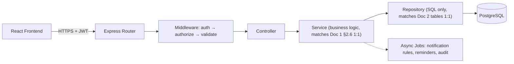
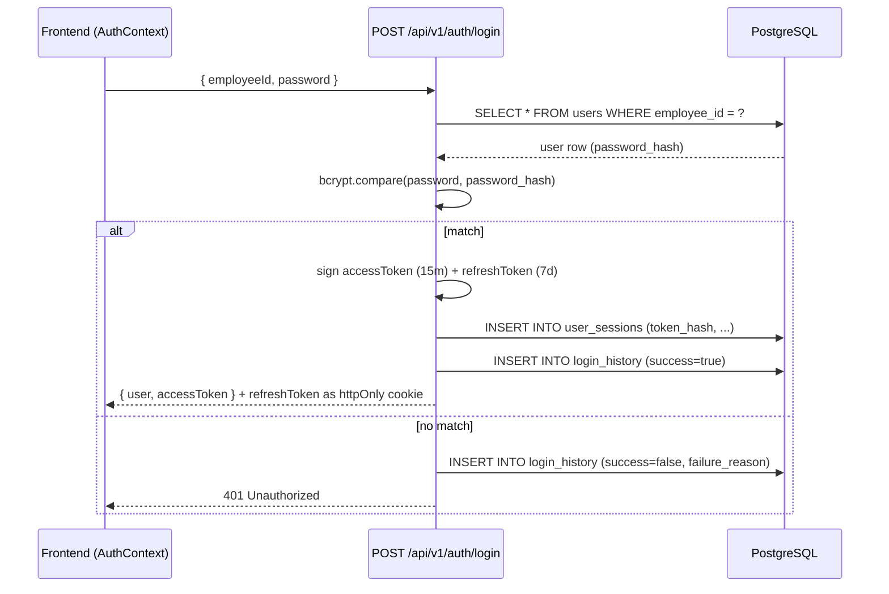

# iFluids PMO Portal
## REST API Specification
### Version 1.0

**Builds on:** [Document 1 — Frontend Data Mapping & Architecture Blueprint](./01-Frontend-Data-Mapping-Architecture-Blueprint.md) and [Document 2 — PostgreSQL Database Design](./02-PostgreSQL-Database-Design.md). Every endpoint below maps to a specific frontend service function (Doc 1 §2.6) and a specific table/view (Doc 2).

**Assumed backend stack:** Node.js, Express.js, PostgreSQL (via `pg`/Knex or Prisma), JWT authentication (access + refresh token pair).

---

## Table of Contents

1. [Conventions](#1-conventions)
2. [Project Folder Structure](#2-project-folder-structure)
3. [Layered Architecture](#3-layered-architecture)
4. [Middleware Stack](#4-middleware-stack)
5. [Authentication & JWT Flow](#5-authentication--jwt-flow)
6. [Role-Based Authorization](#6-role-based-authorization)
7. [Error Handling](#7-error-handling)
8. [Logging](#8-logging)
9. [Full Endpoint Catalogue](#9-full-endpoint-catalogue)
10. [Detailed Endpoint Specifications](#10-detailed-endpoint-specifications)
    - 10.1 [Authentication](#101-authentication)
    - 10.2 [Users](#102-users)
    - 10.3 [Projects](#103-projects)
    - 10.4 [Quantity / Payment Milestones / Expenses](#104-quantity--payment-milestones--expenses)
    - 10.5 [Team Assigned](#105-team-assigned)
    - 10.6 [Invoices](#106-invoices)
    - 10.7 [Customers](#107-customers)
    - 10.8 [Employees (Manpower)](#108-employees-manpower)
    - 10.9 [Timesheets](#109-timesheets)
    - 10.10 [Dashboard](#1010-dashboard)
    - 10.11 [Reports](#1011-reports)
    - 10.12 [Notifications](#1012-notifications)
    - 10.13 [Reminders](#1013-reminders)
    - 10.14 [Audit Logs](#1014-audit-logs)
    - 10.15 [Settings & Documents](#1015-settings--documents)
11. [Implementation Roadmap](#11-implementation-roadmap)

---

## 1. Conventions

- **Base URL:** `/api/v1` (versioned from day one — the frontend has none of this today, so there's no legacy path to preserve).
- **Auth header:** `Authorization: Bearer <access_token>` on every route except `/auth/login` and `/auth/forgot-password`.
- **Response envelope** (success):
  ```json
  { "success": true, "data": { }, "meta": { "page": 1, "pageSize": 10, "total": 42 } }
  ```
  `meta` is present only on paginated list endpoints.
- **Response envelope** (error):
  ```json
  { "success": false, "error": { "code": "VALIDATION_ERROR", "message": "...", "fields": { "prNo": "PR Number already exists" } } }
  ```
- **IDs:** UUIDv4 strings everywhere, matching Doc 2's `id UUID DEFAULT gen_random_uuid()` convention and the frontend's existing `crypto.randomUUID()` usage (Doc 1 §2.7) — no integer IDs anywhere, so no frontend model needs to change shape.
- **Dates:** ISO-8601 (`YYYY-MM-DD` for dates, full ISO datetime with `Z` for timestamps) — identical to what the frontend already produces via `.toISOString()` (Doc 1 §2.2/throughout), so no client-side date parsing changes are required.
- **Money:** always transmitted as JSON numbers in INR (or the item's native currency alongside an INR-converted twin field, mirroring the frontend's own `unitRate`/`unitRateINR` pairing, Doc 1 §4.4) — never strings, never cents-as-integers, to match the frontend's existing `number` typed fields exactly.
- **Pagination:** `?page=1&pageSize=10` query params on every list endpoint (page size 10 matches every paginated table in the current frontend — Doc 1 §4.2/§4.8/§4.9/§4.10/§4.11).
- **Filtering/Search:** `?search=`, plus module-specific filters as query params (e.g. `?department=Process&status=Active`), mirroring each page's existing toolbar filters 1:1 (Doc 1 §4.x).

---

## 2. Project Folder Structure

```
backend/
├── src/
│   ├── config/
│   │   ├── database.ts          # PostgreSQL pool config
│   │   ├── env.ts                # environment variable validation
│   │   └── constants.ts          # shared enums mirroring Doc 2's Postgres ENUM types
│   ├── middleware/
│   │   ├── authenticate.ts       # JWT verification
│   │   ├── authorize.ts          # permission-based route guarding (§6)
│   │   ├── validateRequest.ts    # schema validation (zod/joi) per route
│   │   ├── auditLog.ts           # writes audit_logs on every mutating request (§10.14)
│   │   ├── errorHandler.ts       # central error → response envelope mapper (§7)
│   │   └── requestLogger.ts      # structured request/response logging (§8)
│   ├── routes/
│   │   ├── auth.routes.ts
│   │   ├── users.routes.ts
│   │   ├── projects.routes.ts
│   │   ├── quantityItems.routes.ts
│   │   ├── paymentMilestones.routes.ts
│   │   ├── teamMembers.routes.ts
│   │   ├── invoices.routes.ts
│   │   ├── customers.routes.ts
│   │   ├── employees.routes.ts
│   │   ├── timesheets.routes.ts
│   │   ├── dashboard.routes.ts
│   │   ├── reports.routes.ts
│   │   ├── notifications.routes.ts
│   │   ├── reminders.routes.ts
│   │   ├── auditLogs.routes.ts
│   │   ├── settings.routes.ts
│   │   ├── documents.routes.ts
│   │   └── index.ts               # mounts every router under /api/v1
│   ├── controllers/
│   │   └── <one file per route group above>   # thin: parse req → call service → shape response
│   ├── services/
│   │   └── <one file per route group above>   # business logic — 1:1 mirrors of Doc 1 §2.6's frontend service inventory
│   ├── repositories/
│   │   └── <one file per table/table-group>   # raw SQL/query-builder calls only, no business logic
│   ├── jobs/
│   │   ├── notificationRuleEvaluator.ts  # async worker replacing the frontend's synchronous rule re-evaluation (Doc 2 §18.5)
│   │   ├── reminderScheduler.ts          # server-side cron replacing the frontend's 15s client poll (Doc 1 §4.15)
│   │   └── timesheetImportProcessor.ts   # background Excel-import processing for large files
│   ├── utils/
│   │   ├── projectMatching.ts    # server-side port of utils/projectMatching.ts (Doc 1 §2.9) — PR-Number/Job-Number normalization
│   │   ├── passwordHash.ts       # bcrypt/argon2 wrappers
│   │   └── pagination.ts
│   ├── validators/
│   │   └── <one schema file per route group>  # zod/joi request schemas, one per §10 "Validation Rules" section
│   ├── app.ts                     # Express app assembly (middleware order, route mounting)
│   └── server.ts                  # process entrypoint
├── migrations/                    # one file per Doc 2 table/view/index, in dependency order
├── seeds/                         # ports Doc 1's mock data files (mockUsers.ts, EmployeeMasterData.ts, etc.) into SQL seed data
├── tests/
└── package.json
```

---

## 3. Layered Architecture

Directly continues the Repository → Store → Service pattern already established in the frontend (Doc 1 §2.4) — the backend's **Controller → Service → Repository** split is the server-side half of that same seam:



- **Controller** — parses `req.params`/`req.query`/`req.body`, calls exactly one Service method, maps the result to the response envelope (§1). No business logic, no SQL.
- **Service** — the direct backend counterpart of each frontend service file named in Doc 1 §2.6 (e.g. `ProjectService` mirrors `projectService.ts`, `InvoiceService` mirrors `invoiceProgressService.ts`/`invoiceSyncService.ts`). Owns validation orchestration, cross-table business rules (e.g. the Confirm Invoice Cycle gate, PR-Number matching, GST calculation), and decides what to persist vs. what to compute from a view (Doc 2 §14).
- **Repository** — thin, one per table or tightly-related table group, exposing `findById`, `findAll(filters)`, `create`, `update`, `delete` — no business logic, ever.

---

## 4. Middleware Stack

Applied in this order on every request:

1. `requestLogger` — assigns a request ID, logs method/path/user (§8).
2. `express.json()` — body parsing.
3. `authenticate` — verifies the JWT, attaches `req.user` (§5). Skipped only for `/auth/login`, `/auth/forgot-password`, `/auth/reset-password`.
4. `authorize(permissionCode)` — route-specific, checks `req.user`'s effective permission (role default + user override, Doc 2 §4) before the controller runs (§6).
5. `validateRequest(schema)` — route-specific request-body/query schema validation; short-circuits with `400 VALIDATION_ERROR` before touching the database.
6. Route handler (controller → service → repository).
7. `auditLog` — for mutating routes (`POST`/`PUT`/`PATCH`/`DELETE`), writes one `audit_logs` row **inside the same transaction** as the mutation (Doc 2 §18.6) — never a fire-and-forget side effect.
8. `errorHandler` — final catch-all, maps thrown errors to the error envelope (§7).

---

## 5. Authentication & JWT Flow

Replaces the frontend's current mock `PMOV1`/`PMO@123` string comparison (Doc 1 §2.2) with real credential verification against the `users` table (Doc 2 §4), while keeping the **shape** of what `AuthContext`/`ProtectedRoute` expect unchanged (a `user` object + `loading` boolean) so the frontend's own auth context needs minimal rewiring.



- **Access token:** JWT, 15-minute expiry, payload `{ sub: user.id, role: role.name, employeeId }` — signed `HS256`/`RS256`.
- **Refresh token:** opaque random string, stored **hashed** in `user_sessions.token_hash` (Doc 2 §4), delivered as an `httpOnly`, `Secure`, `SameSite=Strict` cookie — never accessible to frontend JS, closing the frontend's current gap of storing the entire session object in plain `localStorage` (Doc 1 §2.2/§2.5).
- **Silent refresh:** `POST /auth/refresh` (cookie-only, no body) issues a new access token if the refresh token's hash matches an unexpired, unrevoked `user_sessions` row.
- **Logout:** `POST /auth/logout` sets `user_sessions.revoked_at = now()` and clears the cookie — matches the frontend's existing `LogoutDialog` → `logout()` flow (Doc 1 §2.2) one-for-one.
- **First-login forced password change:** if `users.is_first_login = true`, the login response includes `requiresPasswordChange: true`; the frontend must route to a "Set New Password" screen before granting access to any other route — this is new frontend behavior needed to make the existing `isFirstLogin`/`temporaryPassword` fields (Doc 1 §6) actually functional, since today they're captured but never enforced.

---

## 6. Role-Based Authorization

Directly implements Doc 2 §4's `roles`/`permissions`/`role_permissions`/`user_permissions` schema — this is also the piece that finally makes the frontend's already-fully-modeled-but-never-enforced `User.moduleAccess`/`projectRegionAccess`/`approvalRights` (Doc 1 §5's explicit gap) real:

```ts
// middleware/authorize.ts (conceptual)
function authorize(permissionCode: string) {
  return async (req, res, next) => {
    const effective = await getEffectivePermission(req.user.id, permissionCode);
    // effective = user_permissions override row if one exists, else role_permissions default for req.user.role
    if (!effective) return next(new ForbiddenError(permissionCode));
    next();
  };
}
```

- **Module Access** (`dashboard`, `projects`, `customerMaster`, ...) gates entire route groups (e.g. every `/timesheets/*` route requires the `timesheets` permission).
- **Project Region Access** (`india`, `qatar`, ...) is enforced as a **row-level filter**, not just a route gate — every `Project`-returning query joins/filters against the requesting user's granted regions (`WHERE region_id IN (user's granted regions)`), so a user without Qatar access literally cannot retrieve a Qatar project via any endpoint, not just have it hidden in the UI.
- **Approval Rights** (`approveInvoices`, `approveTimesheets`, ...) gate specific state-transition endpoints (e.g. marking an invoice line `Paid` requires `approveInvoices`).
- **Administrator** role bypasses all region-scoping (matches `ROLE_REGION_DEFAULTS.Administrator = ALL_REGIONS` in the frontend, Doc 1 §4.12).

---

## 7. Error Handling

| HTTP Status | `error.code` | When |
|---|---|---|
| 400 | `VALIDATION_ERROR` | Request body/query fails schema validation — `error.fields` maps field name → message, mirroring the frontend's existing `useFormValidation` hook's per-field error shape (Doc 1 §2.8) so the UI's existing error-display components need no changes. |
| 401 | `UNAUTHENTICATED` | Missing/expired/invalid access token. |
| 403 | `FORBIDDEN` | Valid token, but the user lacks the required permission (§6) or region scope. |
| 404 | `NOT_FOUND` | Resource ID doesn't exist (or exists but is outside the user's region scope — returned as 404, not 403, to avoid leaking existence of out-of-scope records). |
| 409 | `CONFLICT` | Uniqueness violation (PR Number, Customer Name, Employee Number, Company Email — Doc 2 §16 Note 7) or an optimistic-concurrency mismatch. |
| 422 | `BUSINESS_RULE_VIOLATION` | Passes schema validation but fails a domain rule (e.g. Qty to Invoice exceeds eligible ceiling, Doc 1 §4.7). |
| 429 | `RATE_LIMITED` | Login endpoint throttling (new — the frontend today has no brute-force protection at all). |
| 500 | `INTERNAL_ERROR` | Unhandled exception — logged with full stack server-side, returned to client with no internal detail. |

---

## 8. Logging

- **Request logs** (`requestLogger`): one structured JSON line per request — `{ requestId, method, path, userId, statusCode, durationMs }` — to stdout, shipped to a log aggregator (ELK/CloudWatch/etc., infra-specific, out of scope here).
- **Audit logs** (`audit_logs` table, Doc 2 §11): the **business-facing** trail (who did what to which record) — distinct from request logs, queryable via the Settings → Security & Audit Logs UI (Doc 1 §4.13), and the piece that closes that module's current "100% synthetic" gap.
- **Error logs:** every `500 INTERNAL_ERROR` is logged with full stack trace + request context server-side (never sent to the client) via the `errorHandler` middleware.

---

## 9. Full Endpoint Catalogue

| Method | URL | Purpose | Auth | Permission |
|---|---|---|---|---|
| POST | `/auth/login` | Authenticate, issue tokens | — | — |
| POST | `/auth/logout` | Revoke current session | ✓ | — |
| POST | `/auth/refresh` | Silent access-token refresh | cookie | — |
| POST | `/auth/forgot-password` | Request a password reset email | — | — |
| POST | `/auth/reset-password` | Complete a password reset | — | — |
| POST | `/auth/change-password` | Change own password (post-first-login) | ✓ | — |
| GET | `/auth/profile` | Current user's own profile | ✓ | — |
| GET | `/users` | List/search/filter users | ✓ | `settings` |
| POST | `/users` | Create user | ✓ | `settings` |
| GET | `/users/:id` | Get one user | ✓ | `settings` |
| PUT | `/users/:id` | Update user | ✓ | `settings` |
| DELETE | `/users/:id` | Delete user | ✓ | `settings` |
| PATCH | `/users/:id/status` | Activate/Deactivate | ✓ | `settings` |
| POST | `/users/:id/reset-password` | Generate + return new temp password | ✓ | `settings` |
| GET | `/departments` | List department master list | ✓ | — |
| POST | `/departments` | Create department (inline "create new") | ✓ | `settings` or `manpower` |
| GET | `/employees/reporting-managers` | Distinct reporting-manager list | ✓ | — |
| GET | `/projects` | List/search/filter/sort/paginate | ✓ | `projects` (region-scoped) |
| POST | `/projects` | Create project | ✓ | `projects` + `approveProjectCreation` |
| GET | `/projects/:id` | Get one project (full nested payload) | ✓ | `projects` (region-scoped) |
| PUT | `/projects/:id` | Update project (General tab) | ✓ | `projects` |
| DELETE | `/projects/:id` | Delete project | ✓ | `projects` + `archiveProjects` |
| POST | `/projects/import` | Bulk Excel/CSV import | ✓ | `projects` |
| GET | `/projects/export` | Export filtered list to Excel | ✓ | `projects` |
| GET | `/projects/template` | Download blank import template | ✓ | `projects` |
| GET | `/projects/:id/quantity-items` | List quantity items | ✓ | `projects` |
| POST | `/projects/:id/quantity-items` | Add quantity item | ✓ | `projects` |
| PUT | `/projects/:id/quantity-items/:itemId` | Update quantity item | ✓ | `projects` |
| DELETE | `/projects/:id/quantity-items/:itemId` | Delete quantity item | ✓ | `projects` |
| GET | `/projects/:id/payment-milestones` | List milestones | ✓ | `projects` |
| POST | `/projects/:id/payment-milestones` | Add milestone | ✓ | `projects` |
| PUT | `/projects/:id/payment-milestones/:milestoneId` | Update milestone | ✓ | `projects` |
| DELETE | `/projects/:id/payment-milestones/:milestoneId` | Delete milestone | ✓ | `projects` |
| GET | `/projects/:id/budget` | Get expense budget fields | ✓ | `projects` |
| PUT | `/projects/:id/budget` | Update expense budget fields | ✓ | `projects` + `approveBudgetChanges` |
| GET | `/projects/:id/expenses` | List Other Project Expenses | ✓ | `projects` |
| POST | `/projects/:id/expenses` | Add expense row | ✓ | `projects` + `approveExpenses` |
| PUT | `/projects/:id/expenses/:expenseId` | Update expense row | ✓ | `projects` + `approveExpenses` |
| DELETE | `/projects/:id/expenses/:expenseId` | Delete expense row | ✓ | `projects` + `approveExpenses` |
| GET | `/projects/:id/team` | Get live team roster (timesheet-derived) | ✓ | `projects` |
| POST | `/projects/:id/team` | Assign a team member | ✓ | `projects` |
| DELETE | `/projects/:id/team/:employeeId` | Release a team member | ✓ | `projects` |
| GET | `/projects/:id/invoices` | List invoice items + lines | ✓ | `invoices` |
| PUT | `/projects/:id/invoice-method` | Choose Lump Sum vs. Line Items | ✓ | `invoices` |
| POST | `/projects/:id/invoices/:invoiceItemId/lines` | Raise a new invoice line | ✓ | `invoices` + `approveInvoices` |
| PUT | `/invoice-lines/:id` | Update an invoice line | ✓ | `invoices` + `approveInvoices` |
| PATCH | `/invoice-lines/:id/status` | Mark Paid/Cancelled | ✓ | `invoices` + `approveInvoices` |
| GET | `/projects/:id/notes` | List workspace notes | ✓ | `projects` |
| POST | `/projects/:id/notes` | Add a note | ✓ | `projects` |
| GET | `/customers` | List/search customers | ✓ | `customerMaster` |
| POST | `/customers` | Create customer | ✓ | `customerMaster` + `approveCustomers` |
| GET | `/customers/:id` | Get one customer | ✓ | `customerMaster` |
| PUT | `/customers/:id` | Update customer | ✓ | `customerMaster` |
| DELETE | `/customers/:id` | Delete customer | ✓ | `customerMaster` |
| POST | `/customers/import` | Bulk import | ✓ | `customerMaster` |
| GET | `/customers/export` | Export to Excel/CSV | ✓ | `customerMaster` |
| GET | `/customers/template` | Download blank template | ✓ | `customerMaster` |
| GET | `/employees` | List/search/filter employees | ✓ | `manpower` |
| POST | `/employees` | Create employee | ✓ | `manpower` |
| GET | `/employees/:id` | Get one employee | ✓ | `manpower` |
| PUT | `/employees/:id` | Update employee | ✓ | `manpower` |
| DELETE | `/employees/:id` | Delete employee | ✓ | `manpower` |
| POST | `/employees/import` | Bulk import from Excel | ✓ | `manpower` |
| GET | `/employees/export` | Export to Excel | ✓ | `manpower` |
| GET | `/employees/template` | Download blank template | ✓ | `manpower` |
| POST | `/timesheets/import` | Upload + process a timesheet workbook | ✓ | `timesheets` |
| GET | `/timesheets/imports` | List import batches | ✓ | `timesheets` |
| POST | `/timesheets/entries` | Manual single-employee entry | ✓ | `timesheets` |
| PUT | `/timesheets/entries/:id` | Edit a manual entry | ✓ | `timesheets` |
| DELETE | `/timesheets/entries/:id` | Delete an entry | ✓ | `timesheets` |
| POST | `/timesheets/sync` | Force re-sync matching against Projects | ✓ | `timesheets` |
| GET | `/reports/timesheet-pending` | Project Timesheet Pending Repository data | ✓ | `timesheets` or `projects` |
| GET | `/dashboard/metrics` | KPISection figures | ✓ | `dashboard` (region-scoped) |
| GET | `/dashboard/hours-overrun` | Loss — Hours widget | ✓ | `dashboard` |
| GET | `/dashboard/timeline-alerts` | Timeline Alerts widget | ✓ | `dashboard` |
| GET | `/dashboard/team-workload` | Team Leads Workload widget | ✓ | `dashboard` |
| GET | `/dashboard/timesheet-pending` | Project Timesheet Pending widget | ✓ | `dashboard` |
| GET | `/dashboard/recent-activity` | Activity Feed widget | ✓ | `dashboard` |
| GET | `/dashboard/top-clients` | Top Clients widget | ✓ | `dashboard` |
| GET | `/dashboard/health-summary` | Project Health Summary widget | ✓ | `dashboard` |
| GET | `/dashboard/department-summary` | Department Summary widget | ✓ | `dashboard` |
| GET | `/dashboard/recent-projects` | Recent Projects widget | ✓ | `dashboard` |
| GET | `/reports/executive-summary` | Reports tab 1 | ✓ | `reports` |
| GET | `/reports/financial-performance` | Reports tab 2 | ✓ | `reports` |
| GET | `/reports/project-performance` | Reports tab 3 | ✓ | `reports` |
| GET | `/reports/resource-utilization` | Reports tab 4 | ✓ | `reports` |
| GET | `/reports/manpower-analytics` | Reports tab 5 | ✓ | `reports` |
| GET | `/reports/invoice-analytics` | Reports tab 6 | ✓ | `reports` |
| GET | `/reports/expense-analytics` | Reports tab 7 | ✓ | `reports` |
| GET | `/reports/customer-analytics` | Reports tab 8 | ✓ | `reports` |
| GET | `/reports/:tab/export` | Export a Reports tab to Excel | ✓ | `reports` |
| GET | `/notifications` | List current user's notifications | ✓ | — |
| PATCH | `/notifications/:id/read` | Mark read | ✓ | — |
| PATCH | `/notifications/:id/archive` | Archive | ✓ | — |
| POST | `/notifications/read-all` | Mark all read | ✓ | — |
| POST | `/notifications/clear-read` | Archive all read | ✓ | — |
| GET | `/projects/:id/reminders` | List a project's reminders | ✓ | `reminders` |
| POST | `/projects/:id/reminders` | Create a reminder | ✓ | `reminders` + `approveReminders` (if required by policy) |
| PUT | `/reminders/:id` | Update a reminder | ✓ | `reminders` |
| DELETE | `/reminders/:id` | Delete a reminder | ✓ | `reminders` |
| POST | `/reminders/:id/snooze` | Snooze | ✓ | `reminders` |
| GET | `/audit-logs` | List/filter audit log entries | ✓ | `settings` (Administrator-tier only, recommended) |
| GET | `/audit-logs/:id` | Get one entry + timeline steps | ✓ | `settings` |
| GET | `/audit-logs/failed-logins` | Failed login report | ✓ | `settings` |
| GET | `/audit-logs/system-timeline` | System activity timeline | ✓ | `settings` |
| GET | `/settings/system` | Get system settings | ✓ | `settings` |
| PUT | `/settings/system/:key` | Update one setting | ✓ | `settings` |
| GET | `/documents` | List documents (optionally by project) | ✓ | `documents` |
| POST | `/documents` | Upload a document | ✓ | `documents` |
| DELETE | `/documents/:id` | Delete a document | ✓ | `documents` |

---

## 10. Detailed Endpoint Specifications

The following endpoints are worked through in full (Method, URL, Purpose, Auth, Permissions, Request Body, Response Body, Status Codes, Validation Rules, Example JSON, Error Responses) as representative templates — every other endpoint in §9 follows the identical envelope/error/validation conventions established here for its module.

### 10.1 Authentication

#### `POST /auth/login`
- **Purpose:** Authenticate an employee ID + password, issue an access token and set a refresh-token cookie.
- **Auth Required:** No.
- **Permissions:** None.
- **Request Body:**
  ```json
  { "employeeId": "PMOV1", "password": "PMO@123" }
  ```
- **Response Body (200):**
  ```json
  {
    "success": true,
    "data": {
      "user": {
        "id": "6f2c...", "employeeId": "PMOV1", "employeeName": "Administrator",
        "email": "administrator@ifluids.com", "role": "Administrator",
        "isFirstLogin": false, "requiresPasswordChange": false
      },
      "accessToken": "eyJhbGciOi..."
    }
  }
  ```
- **Status Codes:** `200` success · `400` missing fields · `401` invalid credentials · `403` account locked (`accountLocked = true`) · `429` too many attempts (rate-limited).
- **Validation Rules:** `employeeId` required, `password` required (min length not enforced beyond "non-empty," matching the current mock's own lack of a complexity rule — recommend tightening at rollout).
- **Error Response (401):**
  ```json
  { "success": false, "error": { "code": "UNAUTHENTICATED", "message": "Invalid employee ID or password." } }
  ```

#### `POST /auth/logout`
- **Purpose:** Revoke the current refresh token/session.
- **Auth Required:** Yes. **Permissions:** None.
- **Request Body:** none. **Response (200):** `{ "success": true, "data": null }`.
- **Status Codes:** `200` · `401` if already unauthenticated.

#### `POST /auth/forgot-password` / `POST /auth/reset-password`
- **Purpose:** Self-service password reset via emailed link (net-new capability — the current frontend's Reset Password is Administrator-triggered only, Doc 1 §4.12).
- **Request (`forgot-password`):** `{ "email": "user@ifluids.com" }` → **Response (200)** always generic (`"If that email exists, a reset link has been sent."`) to avoid user enumeration.
- **Request (`reset-password`):** `{ "token": "...", "newPassword": "..." }` → **Validation:** token must be unexpired/unused; password must meet the org's complexity policy (to be defined; the current frontend enforces none).

#### `POST /auth/change-password`
- **Purpose:** Authenticated user sets a new password (used for both voluntary changes and the forced first-login flow, Doc 1 §6's `isFirstLogin`).
- **Request:** `{ "currentPassword": "Welcome@123", "newPassword": "..." }` (current password omitted/ignored when `isFirstLogin = true`).
- **Response (200):** clears `is_first_login`, `temporary_password_hash`; sets `last_password_reset_at`.

#### `GET /auth/profile`
- **Purpose:** Returns the requesting user's own full profile (replaces `pmo_user_profile` localStorage read, Doc 1 §2.5).
- **Response (200):** the full `User` shape (Doc 1 §6), minus `passwordHash`/`temporaryPasswordHash`.

---

### 10.2 Users

#### `GET /users`
- **Purpose:** Backs `UserTable.tsx`/`UserToolbar.tsx` (Doc 1 §4.12).
- **Query params:** `search`, `role`, `status`, `department`, `page`, `pageSize`.
- **Permissions:** `settings`.
- **Response (200):**
  ```json
  {
    "success": true,
    "data": [ { "id": "...", "employeeId": "EMP-10001", "employeeName": "Rajesh Sharma", "role": "Administrator", "status": "Active", "department": "PMO & Engineering", "email": "rajesh.sharma@ifluids.com", "projectRegionAccess": { "india": true, "qatar": true, "...": false }, "lastLoginAt": "2026-08-01T09:12:00Z" } ],
    "meta": { "page": 1, "pageSize": 10, "total": 20 }
  }
  ```

#### `POST /users`
- **Purpose:** Backs `createUser()` (Doc 1 §4.12) — auto-generates Employee ID, Company Email, and a temporary password server-side.
- **Permissions:** `settings`.
- **Request Body:**
  ```json
  {
    "employeeName": "Kiran Desai", "phone": "+91 98765 00000",
    "departmentId": "5b2e...", "designation": "Junior Engineer",
    "reportingManagerId": "9a1f...", "employeeType": "Contract",
    "roleId": "3c4d...", "status": "Active",
    "moduleAccess": { "dashboard": true, "projects": true, "...": false },
    "projectRegionAccess": { "india": true, "...": false },
    "approvalRights": { "...": false }
  }
  ```
- **Response (201):**
  ```json
  {
    "success": true,
    "data": {
      "id": "e711...", "employeeId": "EMP-10021",
      "email": "kiran.desai@ifluids.com", "temporaryPassword": "X7q!kP2m",
      "isFirstLogin": true, "createdAt": "2026-08-04T10:00:00Z", "createdBy": "PMOV1"
    }
  }
  ```
  `temporaryPassword` is present **only in this one response** — it is never retrievable again in plaintext (Doc 2 §4's auth-flow note).
- **Validation Rules:** `employeeName` required; `departmentId` must exist; `roleId` must exist; `email` uniqueness is server-generated so cannot conflict under normal operation, but a `409 CONFLICT` is still possible on a name-collision retry race.
- **Error Response (409):**
  ```json
  { "success": false, "error": { "code": "CONFLICT", "message": "A user with this generated email already exists; retry." } }
  ```

#### `PUT /users/:id`
- **Purpose:** Backs `updateUser()`. **Important business rule** (Doc 1 §4.12): changing `roleId` **must not** silently overwrite `moduleAccess`/`projectRegionAccess`/`approvalRights` — those only get re-applied to role defaults on user **creation**, never on edit. The service layer must omit permission-recalculation entirely from this endpoint's logic.
- **Request Body:** partial `User` patch (any subset of editable fields; `employeeId` and `email` are immutable except `email`, which only an `Administrator`-role caller may change, per Doc 1 §4.12's "editable only by Administrator" note).
- **Status Codes:** `200` · `403` if a non-Administrator attempts to change `email` · `404` if `id` doesn't exist.

#### `DELETE /users/:id`
- **Purpose:** Backs `deleteUser()` — hard delete, matching the frontend's current `DeleteUserDialog.tsx` behavior (Doc 1 §4.12), though Doc 2 §1 recommends this always fire an `audit_logs` write first.

#### `PATCH /users/:id/status`
- **Purpose:** Backs the Activate/Deactivate row action (Doc 1 §4.12). **Request:** `{ "status": "Inactive" }`.

#### `POST /users/:id/reset-password`
- **Purpose:** Backs `resetUserPassword()` (Doc 1 §4.12) — generates and returns a new temporary password once, sets `isFirstLogin = true`.
- **Response (200):** `{ "success": true, "data": { "temporaryPassword": "N9!vRk3z" } }`.

---

### 10.3 Projects

#### `GET /projects`
- **Purpose:** Backs the Project Repository (Doc 1 §4.2).
- **Query params:** `search`, `department`, `status`, `sortBy`, `sortDir`, `page`, `pageSize`. Automatically region-scoped per §6.
- **Response (200):** array of `Project` summary rows (PR No, Client, Title, Manager, Department, Status, Invoice Status, WO Value, Pending Due) + `meta`.

#### `POST /projects`
- **Purpose:** Backs Add Project (Doc 1 §4.2). Unlike the current frontend, the backend enforces `pr_no` uniqueness at the database layer (Doc 2 §7's ⚠ note) — this is a **behavior change** the frontend must handle (surface the `409` as a field error on PR Number).
- **Permissions:** `projects` + `approveProjectCreation`.
- **Request Body:** the full General-tab field set (Doc 1 §4.2's 15 required fields) plus `quantityItems[]`/`paymentMilestones[]` if submitted in one call (recommended: accept an optional nested array so the frontend's "save progressively across wizard tabs" behavior, Doc 1 §4.2, can be replicated as incremental `PUT` calls against the same `id`, created on the very first "Save & Next" exactly as today).
- **Validation Rules:** the 15 required General-tab fields (Doc 1 §4.2 §12); `prNo` uniqueness (`409` on violation); quantity rows (if included) validated per Doc 1 §4.2 §12's Quantity-tab rules.
- **Error Response (409) — PR Number conflict:**
  ```json
  { "success": false, "error": { "code": "CONFLICT", "message": "PR Number already exists.", "fields": { "prNo": "PR-11040 is already in use." } } }
  ```

#### `GET /projects/:id`
- **Purpose:** Backs Edit/View Project's full workspace load (Doc 1 §4.2). Returns the full nested `Project` object **plus** every computed field from Doc 2 §14's views (`totalWOQty`, `workOrderValueINR`, `gstAmount`, `grandTotal`, each quantity item's `unitRateINR`/`woValue`/`pendingQty`, each milestone's `amount`) already joined server-side — the frontend's `normalizeProject()` recomputation (Doc 1 §2.6) becomes unnecessary and should be deleted once this endpoint is live.

#### `PUT /projects/:id`
- **Purpose:** Backs every General-tab save. **Permissions:** `projects`.

#### `DELETE /projects/:id`
- **Permissions:** `projects` + `archiveProjects` (reflects the frontend's own approval-rights model, Doc 1 §6, even though today's UI doesn't gate the delete button by it).

#### `POST /projects/import` / `GET /projects/export` / `GET /projects/template`
- **Purpose:** Direct ports of `projectWorkbookService.ts` (Doc 1 §4.2/§2.6) — same 4-sheet shape, same all-or-nothing validation semantics on import.

---

### 10.4 Quantity / Payment Milestones / Expenses

Standard nested-resource CRUD under `/projects/:id/...`, following the parent's permission (`projects`) plus the relevant Approval Right for mutating endpoints (`approveBudgetChanges` for `/budget`, `approveExpenses` for `/expenses`). Validation rules are the exact per-row rules cataloged in Doc 1 §4.4/§4.5/§4.6 (e.g. `woQty > 0`, `unitRate > 0`, `paymentPercentage > 0`). Response bodies include the Doc 2 §14 view-computed fields (`unitRateINR`, `woValue`, `pendingQty`, milestone `amount`) alongside the raw stored columns, so the frontend never needs to compute them client-side again.

**Example — `POST /projects/:id/quantity-items`:**
```json
{ "description": "HAZOP Study - Unit 3", "woQty": 1, "uom": "LOT", "currencyCode": "INR", "unitRate": 850000, "assignedToId": "9a1f..." }
```
**Response (201):**
```json
{ "success": true, "data": { "id": "c2f1...", "description": "HAZOP Study - Unit 3", "woQty": 1, "uom": "LOT", "unitRateInr": 850000, "woValue": 850000, "pendingQty": 1, "pendingAmount": 850000 } }
```

---

### 10.5 Team Assigned

#### `GET /projects/:id/team`
- **Purpose:** Backs `ExpandableTeamMembersCard` (Doc 1 §4.3). Returns the **server-computed** join of `team_members` + `v_project_team_hours` (Doc 2 §14) — replacing the frontend's client-side 3-second-poll re-derivation from raw timesheet entries (Doc 1 §4.3) with a single query.
- **Response (200):** one row per assigned employee: `{ employeeId, employeeName, designation, department, reportingManager, workingDays, totalHours, totalCost, averageHoursPerDay, status }`.

#### `POST /projects/:id/team` / `DELETE /projects/:id/team/:employeeId`
- **Purpose:** Formalizes assignment via the new `team_members` table (Doc 2 §16 Note 6) — a genuinely new capability versus today's frontend, which has no explicit "assign" action at all (the roster is purely inferred from timesheet data). **Validation:** rejects a duplicate `(project_id, employee_id)` pair with `409`, matching the legacy `TeamAssignedCard.tsx`'s own duplicate-employee rule (Doc 1 §4.2 §12) even though that component isn't wired into the live frontend today.

---

### 10.6 Invoices

#### `PUT /projects/:id/invoice-method`
- **Purpose:** Backs the Invoice Method gate (Doc 1 §4.7). **Request:** `{ "invoiceMethod": "invoice_line_items" }`. **Business Rule:** once line items exist under a method, switching methods should be blocked (`422 BUSINESS_RULE_VIOLATION`) — a stricter rule than today's frontend, which allows switching at any time; recommended given the financial-integrity stakes.

#### `POST /projects/:id/invoices/:invoiceItemId/lines`
- **Purpose:** Backs "Raise Invoice" (Doc 1 §4.7) — the single most business-logic-heavy write endpoint in the whole API.
- **Permissions:** `invoices` + `approveInvoices`.
- **Request Body (Commercial Milestone example):**
  ```json
  {
    "invoiceNo": "PR-11040-INV-003", "invoiceDate": "2026-08-04",
    "paymentMilestoneId": "d4e5...", "qtyBilled": 1,
    "invoiceAmountInr": 255000
  }
  ```
- **Server-side computation:** `unitPriceInr`/`milestonePercent` are read from the linked Quantity Item/Milestone (never trusted from the client); `calculatedAmountInr = qtyBilled × unitPriceInr × milestonePercent/100`; `commercialAdjustmentInr = invoiceAmountInr − calculatedAmountInr`; both are **stored** as sent (Doc 2 §8's deliberate snapshot design) — never recalculated after this point.
- **Validation Rules:** `qtyBilled` cannot be negative or exceed the eligible ceiling for that milestone/pool (± 0.001 tolerance, Doc 1 §4.7 §12); `invoiceAmountInr` cannot be negative; the **Confirm Invoice Cycle** gate (Doc 1 §4.7) becomes a required `confirmedCycle: true` flag in the request body on the *first* line of a new cycle — the API rejects with `422` and an `requiresCycleConfirmation: true` payload if omitted, letting the frontend reproduce its existing two-step modal confirmation exactly.
- **Error Response (422) — cycle not confirmed:**
  ```json
  { "success": false, "error": { "code": "BUSINESS_RULE_VIOLATION", "message": "Confirm the invoice cycle before saving.", "requiresCycleConfirmation": true, "cycleLabel": "PR-11040-INV-003" } }
  ```
- **Error Response (422) — qty exceeds ceiling:**
  ```json
  { "success": false, "error": { "code": "BUSINESS_RULE_VIOLATION", "message": "Qty to Invoice (5) exceeds the eligible remaining quantity (3)." } }
  ```

#### `PATCH /invoice-lines/:id/status`
- **Purpose:** Backs marking an invoice `Paid`/`Cancelled` (Doc 1 §4.7 — "marking a line Paid **is** how a payment gets recorded"). **Permissions:** `invoices` + `approveInvoices`.

---

### 10.7 Customers

Standard CRUD (§9 catalogue) — validation mirrors `customerService.ts` exactly (Doc 1 §4.8): `customerName` required + unique (case-insensitive, `409` on violation), `email` format-checked (`422` with field error), import is all-or-nothing (`POST /customers/import` returns a `400` with a full row-by-row error list if **any** row fails, matching the frontend's existing all-or-nothing UX so no partial-import edge case needs new frontend handling).

---

### 10.8 Employees (Manpower)

Standard CRUD — `employeeNo` required + unique + immutable after creation (`PUT` silently ignores any attempt to change it, matching the frontend's disabled-input behavior, Doc 1 §4.9, rather than erroring — a deliberate choice to keep the contract forgiving for a field the UI already prevents editing). Import upserts by `employeeNo` (Doc 1 §4.9's `importEmployeesFromExcel` behavior) rather than being all-or-nothing like Customers/Projects — this asymmetry is intentional and matches current frontend behavior exactly, not an inconsistency to fix.

---

### 10.9 Timesheets

#### `POST /timesheets/import`
- **Purpose:** Backs the Excel import flow (Doc 1 §4.10). **Request:** `multipart/form-data` file upload.
- **Server-side processing:** for large files, the endpoint should return `202 Accepted` immediately with an `importId`, process asynchronously via the `timesheetImportProcessor` job (§2's folder structure), and let the frontend poll `GET /timesheets/imports/:importId` for status — a **necessary architecture change** from the frontend's current fully-synchronous client-side parse (Doc 1 §4.10), since PR-Number matching against every existing project (Doc 2 §18.3) is too expensive to do synchronously in the request/response cycle at scale.
- **Validation Rules:** 5 core columns required (employeeNo, employeeName, projectCode, date, totalHours); duplicate `(employeeNo, projectCode, date)` triples within the target month are rejected — **the entire import is atomic** (all rows succeed or none do), exactly matching the frontend's current all-or-nothing guard (Doc 1 §4.10).
- **Response (202):** `{ "success": true, "data": { "importId": "f9a2...", "status": "processing" } }`.
- **Response when polled and complete:**
  ```json
  { "success": true, "data": { "status": "completed", "monthsProcessed": ["2026-06", "2026-07"], "rowsImported": 842, "duplicatesRejected": 0 } }
  ```

#### `GET /reports/timesheet-pending`
- **Purpose:** Backs `getMissingTimesheetProjects()` (Doc 1 §4.10) — the exact same algorithm (reporting month = current month − 1, overdue-since = days past that month's end, project excluded if that month exists in `v_project_submitted_months`, Doc 2 §14) implemented as one SQL query instead of an in-memory JS loop over every project.

---

### 10.10 Dashboard

All ten `/dashboard/*` endpoints (§9) are **read-only, no request body**, differing only in which Doc 2 §14 view(s)/query they compose and what date-relative logic they apply (Doc 1 §4.1's per-widget table is the exact spec for each). Every one accepts no parameters beyond the implicit region-scoping from the requesting user's JWT (§6) — exactly matching the frontend's current "recompute from everything the user can see" behavior, just server-side.

**Example — `GET /dashboard/metrics`:**
```json
{
  "success": true,
  "data": {
    "totalWOValue": 452800000, "totalInvoiceRaised": 198400000,
    "totalOutstanding": 41200000, "totalPaymentReceived": 157200000,
    "totalExpenses": 88500000, "totalProfit": 110300000, "totalProfitPercentage": 24.4,
    "totalProjects": 187
  }
}
```

---

### 10.11 Reports

Eight `GET /reports/:tab` endpoints, one per Doc 1 §4.11's tab list, all accepting the same shared filter query params (`department`, `client`, `executionStatus`, `prCategory`, `dateFrom`, `dateTo`) plus `search`. `GET /reports/:tab/export` streams the current tab's filtered rows as an `.xlsx` download, matching the frontend's existing per-tab export naming (`PMO_Report_{tab}_export.xlsx`, Doc 1 §4.11).

---

### 10.12 Notifications

#### `GET /notifications`
- **Purpose:** Backs `useNotifications()` (Doc 1 §4.14) — now properly scoped per-user via the `notification_recipients` join (Doc 2 §16 Note 5), a genuine behavior improvement over today's single-shared-user frontend model.
- **Response (200):** array of `PMONotification` + the requesting user's own `isRead`/`isArchived` flags.

#### `PATCH /notifications/:id/read` / `PATCH /notifications/:id/archive` / `POST /notifications/read-all` / `POST /notifications/clear-read`
- Mutate only the requesting user's own `notification_recipients` row — never the shared `notifications` row itself.

---

### 10.13 Reminders

Standard nested CRUD under `/projects/:id/reminders`, plus `POST /reminders/:id/snooze`. **Business rule carried over exactly** (Doc 1 §4.15): editing any of `reminderDate`/`reminderTime`/`notifyOffset`/`repeat`/`reminderType`/`priority` resets `notificationGenerated = false`/`triggeredAt = null` server-side, so the (now server-side, cron-based — Doc 1 §4.15/§2's `jobs/reminderScheduler.ts`) scheduler picks it up again at its new time.

---

### 10.14 Audit Logs

#### `GET /audit-logs`
- **Purpose:** Backs `SecurityAuditSection.tsx` (Doc 1 §4.13) — for the first time, genuinely populated by the `auditLog` middleware (§4) on every mutating request across every other module, closing the frontend's current "100% synthetic" gap (Doc 1 §4.13/§5).
- **Query params:** `module`, `status`, `employeeId`, `dateFrom`, `dateTo`, `search`, `page`, `pageSize`.
- **Permissions:** `settings`, recommended restricted further to the `Administrator` role specifically at the route level (audit data is unusually sensitive — the current frontend has no such restriction since the data isn't real).

---

### 10.15 Settings & Documents

`GET/PUT /settings/system/:key` — simple key/value pairs (Doc 2 §13), backing the currently-placeholder "System Preferences" tab (Doc 1 §4.12) once real settings are defined. `POST /documents` accepts `multipart/form-data`, storing the file in object storage (S3-compatible, infra-specific) and persisting only the URL/metadata in the `documents` table (Doc 2 §12) — net-new capability, since the frontend today has no real upload flow at all (Doc 1 §4.2/§4.6).

---

## 11. Implementation Roadmap

A phased build order, sequenced so each phase is independently testable against the frontend before the next begins — deliberately front-loading the modules the rest of the app depends on:

| Phase | Scope | Rationale |
|---|---|---|
| **1 — Foundation** | Database migrations (Doc 2, all tables/views/indexes), `users`/`roles`/`permissions` seed data, JWT auth (§5), RBAC middleware (§6), error/logging middleware (§7/§8) | Nothing else can be meaningfully tested without real auth and a real schema in place. |
| **2 — Master Data** | Customers, Employees (Manpower), Departments, Regions, Currencies CRUD | These are dependencies (FKs) of Projects — must exist first. |
| **3 — Projects Core** | Projects CRUD, Quantity Items, Payment Milestones, Expense Budget | The central module; unblocks Dashboard/Reports work in parallel. |
| **4 — Billing** | Invoice Method gate, Invoice Items/Lines, the Confirm-Cycle business rule, Team Assigned (`team_members` + timesheet-hours view) | The most business-logic-dense phase; budget the most QA time here against Doc 1 §4.7's exact worked examples. |
| **5 — Timesheets** | Import pipeline (async job), PR-Number matching (server-side port of `projectMatching.ts`), Timesheet Pending Repository query | Depends on Phase 3 (Projects) existing; unblocks Dashboard's Timesheet Pending and Hours Overrun widgets. |
| **6 — Dashboard & Reports** | All `/dashboard/*` and `/reports/*` read endpoints | Pure aggregation over Phases 2–5's data; no new write logic. |
| **7 — Notifications & Reminders** | `notifications`/`notification_recipients`, `reminders`, the async rule-evaluation job, the server-side reminder scheduler | Depends on Projects/Timesheets/Invoices existing (rule inputs). |
| **8 — Audit Logging** | Wire the `auditLog` middleware into every Phase 1–7 mutating endpoint, `/audit-logs/*` read endpoints | Deliberately last so it can be retrofitted onto a stable, already-tested set of endpoints rather than built speculatively ahead of the real mutation shapes. |
| **9 — Documents & Settings** | File upload, `/settings/system/*` | Lowest-priority/net-new capability, no existing frontend flow depends on it today. |

---

*End of Document 3. Documents 1–3 together form the complete backend-development reference for the iFluids PMO Portal.*
